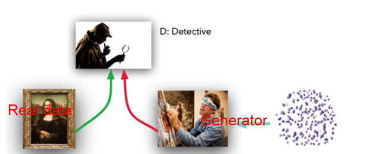

### 一、什么是GAN?
 &ensp;&ensp;2014年，IanGoodfellow和他在蒙特利尔大学的同事发表了一篇令人惊叹的论文（GANs），提出了GANs（生成式对抗网络）。 他们通过创新性地组合计算图和博弈论，展示了给定足够的建模能力，两个相互对抗的模型能够通过普通的反向传播进行共同训练。 
 &ensp;&ensp;模型扮演了两个不同的（确切地说，是对抗的）的角色。 给定一些真实数据集R，G是生成器，试图创建看起来像真实数据的假数据，而D是判别器，从真实数据集或G中获得数据并标记差异。Goodfellow给了一个很贴切的比喻，G像一伙努力用他们的输出匹配真实图画的伪造者，而D是一帮努力鉴别差异的侦探。（唯一的不同是，伪造者G永远不会看到原始数据 –而只能看到D的判断。他们是一伙盲人骗子）。

 &ensp;&ensp;理想状态下，D和G将随着时间的推移而变得更好，直到G真正变成了原始数据的“伪造大师”，而D则彻底迷失，“无法分辨真假”。 
### 二、五十行Pytorch搭建GAN
 &ensp;&ensp;这种强大的技术似乎需要大量的代码才可以，但是使用PyTorch，我们实际上可以在50行代码下创建一个非常简单的GAN。只需要考虑5个组件： 
 R：原始的、真正的数据； 
 I：进入生成器作为熵源的随机噪声； 
 G：努力模仿原始数据的生成器； 
 D：努力将G从R中分辨出来的判别器； 
 训练循环，我们在其中教G来迷惑D，教D鉴别G。 
 （1）R：在我们的例子中，我们将从最简单的R- 一个钟形曲线开始。 钟形函数采用均值和标准差，并返回一个函数，该函数提供了使用这些参数的高斯分布的正确形状的样本数据。在我们的示例代码中，我们将使用均值4.0和标准差1.25。 

    def get_distribution_sampler(mu, sigma):
    	return lambda n: torch.Tensor(np.random.normal(mu, sigma, (1, n))).to(device)
 （2）I：进入生成器的输入也是随机的，但是为了使我们的工作更难一点，让我们使用一个均匀分布，而不是一个普通的分布。这意味着我们的模型G不能简单地移动/缩放输入以复制R，而是必须以非线性方式重塑数据。 

    def get_generator_input_sampler():
    	return lambda m, n: (torch.rand(m, n)).to(device)
 （3）G：生成器是一个标准的前馈网络 - 两个隐藏层，三个线性映射。我们使用ELU（exponential linear unit，ELU）。 G将从I获得均匀分布的数据样本，并以某种方式模仿来自R的正态分布样本。 

    #生成器模为全连接层
	class Generator(nn.Module):
	    def __init__(self, input_size, hidden_size, output_size, f):
	        super(Generator, self).__init__()
	        self.map1 = nn.Linear(input_size, hidden_size)
	        self.map2 = nn.Linear(hidden_size, hidden_size)
	        self.map3 = nn.Linear(hidden_size, output_size)
	        self.f = f
	
	    def forward(self, x):
	        x = self.map1(x)
	        x = self.f(x)
	        x = self.map2(x)
	        x = self.f(x)
	        x = self.map3(x)
	        return x

 （4）D：鉴别器代码与生成器G的代码非常相似;具有两个隐藏层和三个线性映射的前馈网络。 它将从R或G获取样本，并将输出介于0和1之间的单个标量，解释为“假”与“真”。 

    #鉴别器模型
	class Discriminator(nn.Module):
	    def __init__(self, input_size, hidden_size, output_size, f):
	        super(Discriminator, self).__init__()
	        self.map1 = nn.Linear(input_size, hiddsen_size)
	        self.map2 = nn.Linear(hidden_size, hidden_size)
	        self.map3 = nn.Linear(hidden_size, output_size)
	        self.f = f
	
	    def forward(self, x):
	        x = self.f(self.map1(x))
	        x = self.f(self.map2(x))
	        return self.f(self.map3(x))
 （5）最后，训练在两种模式之间循环交替：首先在真实数据与假数据上用准确的标签训练D，; 然后用不准确的标签训练G来愚弄D。 
