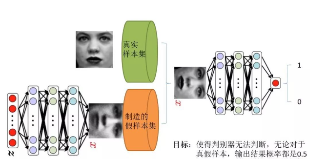
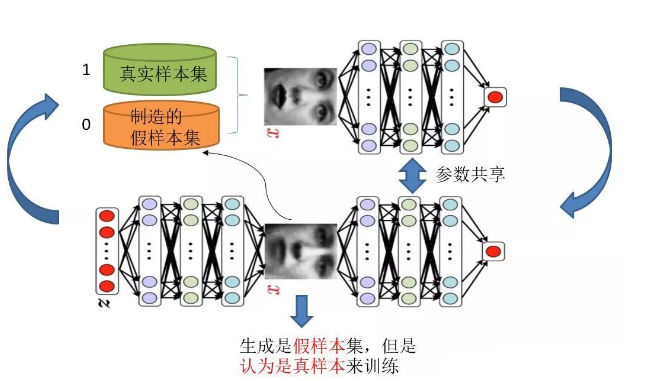
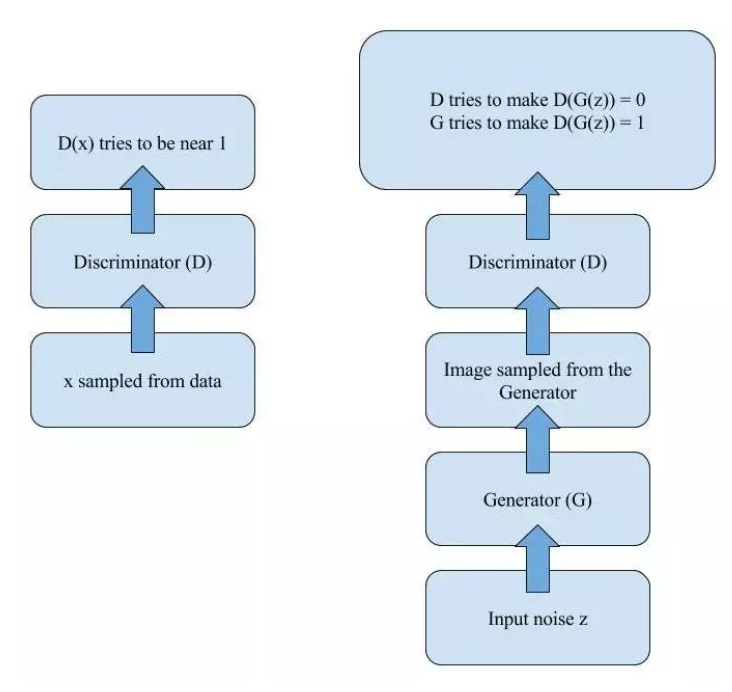
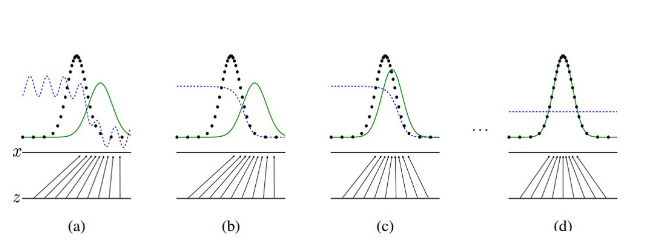
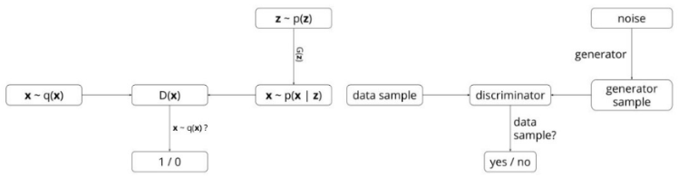

<head>

</head>
### 一、前言
&ensp;&ensp;我们知道GAN的思想是是一种二人零和博弈思想（two-player game），博弈双方的利益之和是一个常数，比如两个人掰手腕，假设总的空间是一定的，你的力气大一点，那你就得到的空间多一点，相应的我的空间就少一点，相反我力气大我就得到的多一点，但有一点是确定的就是，我两的总空间是一定的，这就是二人博弈，但是呢总利益是一定的。

&ensp;&ensp;引申到GAN里面就是可以GAN中有两个这样的博弈者，一个名字为生成模型（G），另一个名字为判别模型（D）。他们的功能各异

&ensp;&ensp;G和D的相同点是，这两个模型互不干扰，是独立的模型，有自己的输入和输出；他们的不同点是，G生成模型的功能是生成器，输入一个样本/噪声，输出是一个高仿的样本。D鉴别模型是用来鉴别输入样本的信息。下文则以图片的分类为例。

Fig1

&ensp;&ensp;**我们有什么？**在上面个的内容中我们有的只是真实采集而来的人脸的样本数据集，仅此而已，但是我们没有人脸数据集的标签，我们不知道人脸的对应关系。

&ensp;&ensp;**我们要得到什么？**最原始的GAN目的，想通过输入噪声，模拟得到一个人脸图像，这个图像可以非常逼真，甚至可以以假乱真

###二、判别模型和生成模型
&ensp;&ensp;判别模型，Fig1中的右半部分的网络，直观来看就是一个简单的神经网络结构，输入就是一副图像，输出就是一个概率值，用于判断真假使用（概率值大于0.5就是真，小于0.5就是假），真假也不过是人们定义的概率而已。

&ensp;&ensp;生成模型，也可以看成一个简单的神经网络结构，输入是一组随机数Z,输出是一个图像，不再是一个数值而已。从图中可以看到，会存在两个数据集，一个是真实数据集，另一个是家的数据集，那这个数据集就是生成网络造出来的数据集。进一步去理解GAN的目标是什么

###三、判别网络和生成网络
&ensp;&ensp;判别网络的目的，是能够判别出来任何一张图是来自真实样本还是假的样本集。加入输入的是真样本，网络输出就接近1，输入的是假样本，网络输出接近0，那么这个结果是我们想要的。

&ensp;&ensp;生成网络是造样本，它的目的就是使得自己造样本的能力尽可能强，强到什么程度呢，使得判别网络没法判断是真样本还是假样本。

###四、对抗网络
&ensp;&ensp;以上的生成网络和鉴别网络就可以称为对抗网络。判别网络说，我很强，来一个样本我就知道他是来自真样本还是假样本。生成网络不甘示弱，表示自己也很强，生成网络争取生成一个假样本，只有它自己知道是假样本，但是争取判别网络不知道，将这个假样本包装的很逼真，以至于判别网络无法判断真假，那么 用输出的数值来解释就是，生成网络生成的假样本在输入至判别网络后，判别网络给出的结果就是接近0.5的值，极限情况就是0.5，也就是说判别不出来了。

&ensp;&ensp;由这个分析可以发现，生成网络与判别网络的目的正好是相反的，一个说我能判别的好，一个说我让你判别不好。所以叫做对抗，叫做博弈。那么最后的结果到底是谁赢呢？这就要归结到设计者，也就是我们希望谁赢了。作为设计者的我们，我们的目的是要得到以假乱真的样本，那么很自然的我们希望生成样本赢了，也就是希望生成样本很真，判别网络能力不足以区分真假样本位置。

###五、模型的训练
&ensp;&ensp;对抗的问题就如上文的描述，如何训练对抗网络的模型呢，如下图Fig2

Fig2

需要注意的是生成模型与对抗模型可以说是两个完全独立的模型，好比就是完全独立的两个神经网络模型，他们之间没什么联系。

&ensp;&ensp;训练的方法简单来说就是 ：**单独交替迭代的训练**，两个网络独特的气质

&ensp;&ensp;**假设现在生成网络模型已经有了**（当然可能不是最好的生成网络），那么给一堆随机数组，就会得到一堆假的样本集（因为不是最终的生成模型，那么现在生成网络可能就处于劣势，导致生成的样本就不咋地，可能很容易就被判别网络判别出来了说这货是假冒的），但是先不管这个，假设我们现在有了这样的假样本集，真样本集一直都有，现在我们人为的定义真假样本集的标签，因为我们希望真样本集的输出尽可能为1，假样本集为0，很明显这里我们就已经默认真样本集所有的类标签都为1，而假样本集的所有类标签都为0. 

&ensp;&ensp;有人会说，在真样本集里面的人脸中，可能人脸是不同人的脸，这不是我们所分类关注的问题，我们仅仅需要关注这张图片来自哪里，是真还是假就可以了。我们做的是简单的二分类的问题。假设鉴别器已经训练完毕。

&ensp;&ensp;**对于生成网络**，我们的目的是生成尽可能逼真的样本。那么原始的生成网络生成的样本你怎么知道它是真还是假的？则**这就需要送到判别网络中**，所以训练生成网络的时候，我们需要联合判别网络一起才能达到训练目的，**但是我们在反向传递的时候不能更改原始判别网络的参数**，我们只能反向改变生成网络的参数。所以对于生成网络的训练其实是对生成-判别网络的串接训练，正如图中显示的那样。分析一下样本，原始的噪声组Z我们有，也就是生成的假样本我们有，很关键的一点是我们要把这些假样本的标签都设置为1，也就是认为这些假样本在生成网络的训练的时候是真样本。**那么为什么要这样呢？**我们想想，是不是这样才能**起到迷惑判别器的目的**，也才能使得**生成的假样本逐渐逼近为正样本**。好了，重新顺一下思路，现在对于生成网络的训练，我们有了样本集（只有假样本集，没有真样本集），有了对应的label（全为1），是不是就可以训练了？有人会问，这样只有一类样本，训练啥呀？谁说一类样本就不能训练了？只要有误差就行。还有人说，你这样一训练，判别网络的网络参数不是也跟着变吗？没错，这很关键，**所以在训练这个串接的网络的时候**，一个很重要的操作就是**不要判别网络的参数发生变化，也就是不让它参数发生更新，只是把误差一直传，传到生成网络那块后更新生成网络的参数。**这样就完成了生成网络的训练了。

&ensp;&ensp;在完成生成网络的训练后，我们是不是可以根据目前新的生成网络再对先前的那些噪声Z生成的新的假样本进行测试了，没错，并且训练后的假样本应该是更真了才对。然后又有了新的真假样本集（其实是新的假样本集），这样又可以重复上述的过程了。我们把这个过程称作为单独交替训练。我们可以实现定义一个迭代次数，交替迭代到一定次数后停止即可。这个时候我们再去看看噪声Z生成的假样本会发现，原来已经很真实了。

###六、模型的数学原理
目标公式：

$\\min\_{G}max\_{D} V(D,G) =E\_{x \sim P\_{data}(x)}[log(D(x))] + E\_{z \sim P\_{z}(z)}[log(1-D(G(z)))]$

&ensp;&ensp;上述这个公式说白了就是一个最大最小优化问题，其实对应的也就是上述的两个优化过程。有人说如果不看别的，能达到看这个公式就拍案叫绝的地步，那就是机器学习的顶级专家，哈哈，真是前路漫漫。同时也说明这个简单的公式意义重大，后期结合李宏毅老师的相关视频推导一遍。

&ensp;&ensp;这个公式既然是最大最小的优化，那就不是一步完成的，其实对比我们的分析过程也是这样的，这里现优化D，然后在取优化G，本质上是两个优化问题，把拆解就如同下面两个公式：

优化D：

$\\max\_{D} V(D,G) =E\_{x \sim P\_{data}(x)}[log(D(x))] + E\_{z \sim P\_{z}(z)}[log(1-D(G(z)))]$

优化G：

$\\min\_{G}V(D,G) = E\_{z \sim P\_{z}(z)}[log(1-D(G(z)))]$

Fig3

&ensp;&ensp;可以看到，优化D的时候，也就是判别网络，其实没有生成网络什么事，后面的G(z)这里就相当于已经得到的假样本。优化D的公式的第一项，使的真样本x输入的时候，得到的结果越大越好，可以理解，因为需要真样本的预测结果越接近于1越好嘛。对于假样本，需要优化是的其结果越小越好，也就是D(G(z))越小越好，因为它的标签为0。但是呢第一项是越大，第二项是越小，这不矛盾了，所以呢把第二项改成1-D(G(z))，这样就是越大越好，两者合起来就是越大越好。 那么同样在优化G的时候，这个时候没有真样本什么事，所以把第一项直接却掉了。这个时候只有假样本，但是我们说这个时候是希望假样本的标签是1的，所以是D(G(z))越大越好，但是呢为了统一成1-D(G(z))的形式，那么只能是最小化1-D(G(z))，本质上没有区别，只是为了形式的统一。之后这两个优化模型可以合并起来写，就变成了最开始的那个最大最小目标函数了。

&ensp;&ensp;所以回过头来我们来看这个最大最小目标函数，里面包含了判别模型的优化，包含了生成模型的以假乱真的优化，完美的阐释了这样一个优美的理论。

###七、总结
&ensp;&ensp;有人说GAN强大之处在于可以自动的学习原始真实样本集的数据分布，不管这个分布多么的复杂，只要训练的足够好就可以学出来。针对这一点，感觉有必要好好理解一下为什么别人会这么说。

&ensp;&ensp;我们知道，传统的机器学习方法，我们一般都会定义一个什么模型让数据去学习。比如说假设我们知道原始数据属于高斯分布呀，只是不知道高斯分布的参数，这个时候我们定义高斯分布，然后利用数据去学习高斯分布的参数得到我们最终的模型。再比如说我们定义一个分类器，比如SVM，然后强行让数据进行东变西变，进行各种高维映射，最后可以变成一个简单的分布，SVM可以很轻易的进行二分类分开，其实SVM已经放松了这种映射关系了，但是也是给了一个模型，这个模型就是核映射（什么径向基函数等等），说白了其实也好像是你事先知道让数据该怎么映射一样，只是核映射的参数可以学习罢了。

&ensp;&ensp;**所有的这些方法都在直接或者间接的告诉数据你该怎么映射一样**，只是不同的映射方法能力不一样。那么再来看看GAN，生成模型最后可以通过噪声生成一个完整的真实数据（比如人脸），说明生成模型已经掌握了从随机噪声到人脸数据的分布规律了，有了这个规律，想生成人脸还不容易。然而这个规律我们开始知道吗？显然不知道，如果让你说从随机噪声到人脸应该服从什么分布，你不可能知道。这是一层层映射之后组合起来的非常复杂的分布映射规律。然而GAN的机制可以学习到，也就是说GAN学习到了真实样本集的数据分布。
&ensp;&ensp;再拿原论文中的一张图来解释： 

Fig4

Fig5

&ensp;&ensp;这张图表明的是GAN的生成网络如何一步步从均匀分布学习到正太分布的。原始数据x服从正太分布，这个过程你也没告诉生成网络说你得用正太分布来学习，但是生成网络学习到了。假设你改一下x的分布，不管什么分布，生成网络可能也能学到。这就是GAN可以自动学习真实数据的分布的强大之处。

&ensp;&ensp;还有人说GAN强大之处在于可以自动的定义潜在损失函数。什么意思呢，这应该说的是判别网络可以自动学习到一个好的判别方法，其实就是**等效的理解为可以学习到好的损失函数**，来比较好或者不好的判别出来结果。虽然大的loss函数还是我们人为定义的，基本上对于多数GAN也都这么定义就可以了，**但是判别网络潜在学习到的损失函数隐藏在网络之中**，不同的问题这个函数就不一样，所以说可以自动学习这个潜在的损失函数。