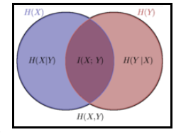
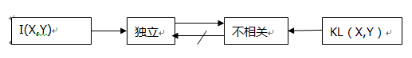
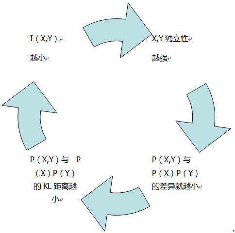

<head>

</head>
###一、信息度量

&ensp;&ensp;信息论中，把信息大小解释为其不确定度。如果一个事件必然发生，那么他没有不确定度，也就不包含信息。即信息=不确定度。
借用数学之美中的一个例子：

&ensp;&ensp;马上要举行世界杯赛了。大家都很关心谁会是冠军。假如我错过了看世界杯，赛后我问一个知道比赛结果的观众“哪支球队是冠军”？ 他不愿意直接告诉我， 而要让我猜，并且我每猜一次，他要收一元钱才肯告诉我是否猜对了，那么我需要付给他多少钱才能知道谁是冠军呢? 我可以把球队编上号，从 1 到 32， 然后提问： “冠军的球队在 1-16 号中吗?” 假如他告诉我猜对了， 我会接着问： “冠军在 1-8 号中吗?” 假如他告诉我猜错了， 我自然知道冠军队在 9-16 中。这样只需要五次， 我就能知道哪支球队是冠军。所以，谁是世界杯冠军这条消息的信息量只值五块钱。 

&ensp;&ensp;如果我们再考虑不同球队获胜的不同比例，如巴西比例高，中国比例低些，那么结果又会不同。

###二、互信息、联合熵、条件熵的相关定义

Fig1

两个随机变量X,Y；H(x)表示其信息量，也就是自信息；

$H(P)=-\sum_{x \in X}P(x)logP(x)$

H（X|Y）表示**已知Y的情况下X的信息量**，同理，H（Y|X）也是。

H（X,Y）表示**X，Y的联合熵**，也就是这两个变量**联合表示的信息量**。

H（X;Y），也就是I（X;Y），也就是**互信息**,指的是两个变量**重复的部分**。

H（X;Y）=H（X,Y）- H（X|Y）- H（Y|X）,这个等式从上图也能形象地看出。

$H(P)=-\sum_{x \in X}P(x,y)log \frac{P(x,y)}{P(x)P(y)}$
###三、KL divergence
&ensp;&ensp;在信息论和概率论中，KL散度描述两个概率分布P和Q之间的相似程度，另外一种理解是，已知Q的分布，用Q的分布近似估计P，P的不确定度减少了多少。

定义为：
$D(P||Q)=\sum_{i=1}^{n}P(x)log\frac{P(x)}{Q(x)}$

&ensp;&ensp;也就是用一个也就是用一个分布来表征另一个分布的额外不确定度，P(x)=Q(x),他们的KL距离为0;否则，差异越大，距离越大。

$\\ p(z\_i)\sim N(\mu\_1,\sigma\_{1}^{2});q(z\_i)\sim N(\mu\_2,\sigma\_{2}^{2})$

$KL(p,q)=-\int p(x)\log q(x)dx + \int p(x)\log p(x)dx$

$=\frac{1}{2}\log (2\pi \sigma\_{2}^{2})+\frac {\sigma\_{1}^{2}+(\mu\_1-\mu\_2)^2}{2\sigma\_{2}^{2}}-\frac{1}{2}(1+\log 2\pi \sigma_{1}^{2})$

$=\log \frac{\sigma \_2}{\sigma \_1}+\frac {\sigma\_{1}^{2}+(\mu\_1-\mu\_2)^2}{2\sigma\_{2}^{2}}-\frac{1}{2}$

###四、互信息与KL距离
&ensp;&ensp;插入一个概念：独立与相关

&ensp;&ensp;概率中的相关概念指的是线性相关，而是否独立，则取决于线性以及非线性的关系。

&ensp;&ensp;**区别**：X,Y的互信息I(X,Y)表征其独立程度，KL距离表征其线性相关性，

Fig2

&ensp;&ensp;**联系**：X,Y的互信息也就是P(X,Y)与P(X),P(Y)的KL距离

Fig3

得出如下的公式：
I(X,Y) = EX[KL(P(Y|X),P(Y))],用P（Y|X）来代替P（Y），不确定度减少了多少？其关于X求和后就是X，Y的互信息。

**例子：**

&ensp;&ensp;南京的天气为随机变量D，某个南京的同学的穿着W。我想通过W，了解D。也就是用P(D|W)来近似P(D)，现在定量地计算我们通过穿着，了解了多少关于天气的信息。

&ensp;&ensp;也就是用P(D|W)来代替P(D)编码，减少了多少不确定度？

&ensp;&ensp;用KL距离来表征，就是：D(P(D|W)||P(D))。

&ensp;&ensp;接着，如果已知一个穿着wi,可以选择最大KL距离D(P(dj|wi)||P(dj))的dj，也就是最可能的天气。

&ensp;&ensp;这就是KL距离的物理意义在实际中的一些运用。

###五、JS_Divergence
&ensp;&ensp;JS 散度度量了两个概率分布的相似度，基于 KL 散度的变体，解决了 KL 散度非对称的问题。一般地，JS 散度是对称的，其取值是 0 到 1 之间。

定义为：

$JS(p||q)=\frac{1}{2}KL(p||\frac{p+q}{2})+\frac{1}{2}KL(q||\frac{p+q}{2})$

&ensp;&ensp;KL 散度和 JS 散度度量的时候有一个问题：

&ensp;&ensp;如果两个分配 P,Q 离得很远，完全没有重叠的时候，那么 KL 散度值是没有意义的，而 JS 散度值是一个常数，这就意味这一点的梯度为 0。