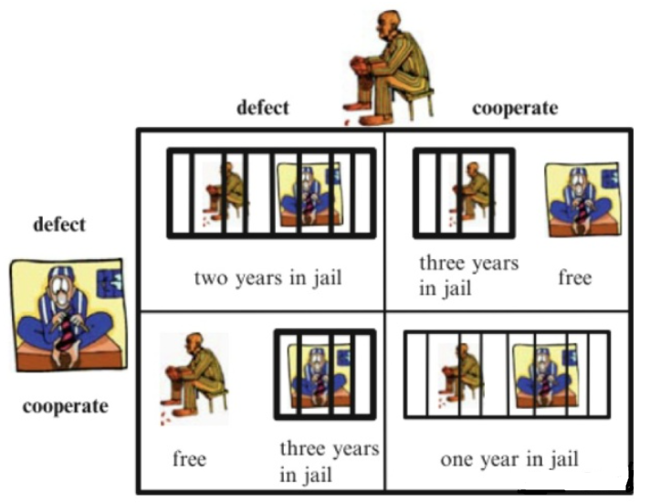

<head>

</head>
###一、概念
&ensp;&ensp;纳什均衡问题却是一个非零和博弈问题，如果双方合作是可以取得共赢的。

&ensp;&ensp;比如上面的囚徒困境，两个罪犯被警察抓住了，各自关押不能交流。如果双方都认罪，各自关押2年。如果一方认罪一方不认罪，则认罪的释放，不认罪的被关押3年。如果双方都不认罪，则各自关押1年，这就是“纳什平衡点”。

&ensp;&ensp;如果从第三方看，两人都不认罪是最佳的，总共加起来只关押2年。但是从个人角度来看就有风险了，因为对方的背叛导致可能自己被关3年，所以最后很有可能两者选择了加起来被关押年数最差的结果，即各自关2年，互相不配合。

&ensp;&ensp;这就是困境，它反应出难以达到“纳什平衡点

###二、GAN中的纳什均衡
1、在GAN第一篇论文中，说纳什均衡点是D输出总是0.5，这个0.5是怎么得到的？

2、在一些文章中，有如下图这样的公式，如何理解

$\\ D^*(x)=\frac{P\_r(x)}{P\_r(x)+P\_g(x)}$

其实，这两个表达比较类似。
&ensp;&ensp;先说明将会用到的参数的含义：

&ensp;&ensp;(1)x表示输入辨别器Discriminator（以下简称D）的图像，这里不区分是哪里来的

&ensp;&ensp;(2)表示D对一个真实图像的输出值，这是一个随机变量，不是一个确定的值。这里r表示real

&ensp;&ensp;(3)表示D对一个从生成器Generator（以下简称G）中得到的图像的输出值，也是一个随机变量；

&ensp;&ensp;(4)D(x)表示D对一个输入的输出值；

&ensp;&ensp;(5)L(D)表示D的损失函数。  
我们直接假设损失函数L(D)已经定义好，形式如下：

$\\ L(D)=\int\_{x}[P\_r(x) * \log(D(x)) + P\_g(x) * \log(1-D(x))]dx$

看到这个损失函数类似交叉损失函数。正常情况下，我们求损失时，我们默认$P_r(x)$就等于1。公式中的积分实际上是因为我们的随机变量是很多的，不是一个值。这时我们不继续考虑积分的影响，于是上面的公式变成：

$\\ L(D)=P\_r(x) * \log(D(x)) + P\_g(x) * \log(1-D(x))dx$

这时我们需要求出D的最佳对策，也就是不管你给D输入什么，D都能最大概率是对的。也就是求上式中L(D)的极小值。我们肯定可以直接求导，并令导数等于0即可。为了简单求导（对D(x)求导），我们简化一下上面的参数表示：

$\\ \overline{x} = D(x),A=P\_r(x),B=P\_g(x)$

简化得：
$f(\overline{x})=A\log\overline{x}+Blog(1-\overline{x})$

求导：
$\frac{df(\overline{x})}{d(\overline{x})}=A * \frac{1}{ln10} * \frac{1}{\overline{x}} - B * \frac{1}{ln10} * \frac{1}{1-\overline{x}} = \frac{1}{ln10} * \frac{A-(A+B)\overline{x}}{\overline{x}(1-\overline{x})}$

然后我们令导数为0，可得：
$\\ D^*(x)= \overline{x}^{\*} =\frac{A}{A+B}=\frac{P\_r{(x)}}{P\_r{(x)}+P\_g{(x)}}\in[0,1]$

举个例子来说，假如总是给D输入真实的图片，D的最佳结果就是总是输出1，因为这时$P_g(x)$接近于0。反之亦然。

我们假设当G产生的图片和真实图片完全一样时，那么这时$P_g(x)$和$P_r(x)$就相等了，所以D最后只能输出0.5来确保自己在上述那样的损失函数情况下损失最