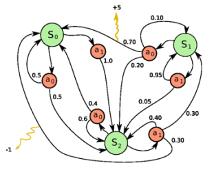

<head>

</head>

学习笔记参考视频：
[https://www.bilibili.com/video/BV1LE411G7Xj](https://www.bilibili.com/video/BV1LE411G7Xj)

资料参考：
[http://incompleteideas.net/book/RLbook2018.pdf](http://incompleteideas.net/book/RLbook2018.pdf)
## Reinforcement Learning基础与概要
###一、什么是强化学习？

Fig1

&ensp;&ensp;强化学习的目的是探索一个Agent如何在复杂的环境中极大化它的奖励。强化学习由Agent和Environment两部分构成，Agent采取action对Environment造成影响，Environment会对action进行评估，对Agent进行state反馈和Reward奖励值的反馈。环境的不确定性以及反馈的延迟性造成了训练异常的困难。

&ensp;&ensp;**对比监督学习和强化学习：**监督学习有明确的标记图片、数据遵循独立分布预测的结果可以进行及时的反馈；强化学习没有独立的数据，它的数据都是关于时间相关的数据，同时没有准确的反馈来指导正确的行为，延时进行奖励，通过不断的尝试进行一些行为来增加获取更多奖励的可能性。
&ensp;&ensp;**关于Pong游戏的例子：**

Fig2

Fig3

Fig4

&ensp;&ensp;右侧是我们的Agent，我们需要判断每一次Agent是往上移动还是往下移动，如果在监督学习中则可以通过标签的预训练来直接得出此时应该向上移动还是向下移动，而在强化学习中是进行完一局游戏之后进行回滚（得到整句游戏的行为Fig4），然后去分析每一步如Fig3的行为，看最后的对战结果进行奖励。

###二、时序决策过程

Fig5

**1、**;agent学习如何和环境进行交互，agent产生相关的行为，环境对agent的行为进行观测并给予奖励。

**2、奖励的性质**

1. 奖励是一个反馈的信号
2. 表明在第t步agent表现如何
3. 强化学习的基础就是奖励最大化
4. agent的所有目标可以被描述为期待积累奖励最大化（eg：在下象棋中，最后可能成功或者失败）

**3、采取时序决策**

Fig6

&ensp;&ensp;agent的目的是采取一系列的action去最大化所有的未来奖励；action也许有着长期的影响；如上图Fig6所示，奖励也是必须等采取所有action之后被延时返回；所以要会均衡立刻的奖励和长期奖励的关系。

&ensp;&ensp;历史序列$H\_t$可以表示为观测结果O、行为A、奖励R，$H\_t=O\_1,R\_1,A\_1,...,A\_{t-1},O\_t,R\_t$，下一步发生什么依靠历史的行为，状态函数常常决定下一步发生什么，$S\_t=f(H\_t)$

&ensp;&ensp;在状态中分为环境状态$S^e\_t=f^e(H\_t)$和agent状态$S^a\_t=f^a(H\_t)$；**agent直接的观察**环境的状态，这种被称为马尔可夫决策过程（MDP）$O\_t=S^e\_t=S^a\_t$；**agent间接的观察**环境称为部分可观测，agent不直接的观察环境，被称为部分观测马尔可夫决策过程(POMDP)。

**4、强化学习agent的主要组成**

**策略(Policy)：agent的行为函数：**

Fig7

1. 策略是agent的行为模型
2. 它可以看作是状态/观察值（state/observation）到行为（action）的一个映射。
3. 静态策略（Stochastic policy）：概率采样，对所有行为的概率分布进行采样$\pi(a|s)=P[A\_t=a|S\_t=s]$
4. 决定性策略（Deterministic policy）：$a^*=argmax_a\pi(a|s)$，已经有相关概率模型，只需要找到最大action的状态即可。

**价值函数(Value function)：policy生成一个价值函数，对现在当前的状态进行评估**

1. 价值函数被称为在一个特定的policy$\pi$下，未来奖励的期望折扣总和。
2. 折扣因子当下的权重影响着未来的奖励
3. 用于量化状态和行为的好坏，$\pi$函数表示我们已知policy function的时候会得到多少的奖励，对未来的奖励进行折合加减
$$v\_\pi(s)=E\_\pi[G\_t|S\_t=s]=E\_\pi[\sum\_{k=0}^{\infty}\gamma^kR\_{t+k+1}|S\_t=s],for \quad all \quad s \in S$$
4. Q—function通常被用来选取行为，强化学习算法是学习的函数，最优的行为通过Q函数得到。
$$q\_\pi(s)=E\_\pi[G\_t|S\_t=s,A\_t=a]=E\_\pi[\sum\_{k=0}^{\infty}\gamma^kR\_{t+k+1}|S\_t=s,A\_t=a]$$

**模型（Model）：agent对整个环境的理解**

1. 模型预测着环境下一步环境将要做什么
2. 预测下一个状态：
$$P\_{ss^/}^a=P[S\_{t+1}=s^/|S\_t=s,A\_t=a]$$
3. 预测下一次奖励：
$$R\_s^a=E[R\_{t+1}|S\_t=s,A\_t=a]$$

**5、马尔可夫决策过程**

Fig8

马尔可夫决策过程的定义：

1. $P^a$是每个动作的转换模型$P(S\_{t+1}=s^/|S\_t=s,A\_t=a)$
2. R是一个奖励函数$R(S\_t=s,A\_t=a)=E[R\_t|S\_t=s,A\_t=a]$
3. 折扣因子$\gamma \in [0,1]$

**6、时序决策过程中两个基本的问题（例子见第四部分）**

**按照预期规划（Planning）**

- 给出环境如何工作的模型

- 计算出在没有外部交互情况下如何最大化期望的奖励

- 类似在路径规划的游戏中，玩家已经知道了地图的样子，需要找到一条最短的的距离即可（类似动态规划）

**强化学习（Reinforcement learning）**

- agent不知道世界如何工作

- 在和世界的交互中去不断学习世界如何工作

- agent提高策略，当然耶涉及了计划

- 类似在路径规划的过程中，玩家开始对地图（类似一个黑盒子）毫不知情，必须自己去摸索着走，撞到墙了则回头，表示前面没有路了，所以它需要了解环境之后再给出一条最短的路径。

**7、Exploration and Exploitation**

- Exploration代表如何探索环境通过尝试不同的行为让奖励值最大化，一个最优的策略

- Exploitation不尝试其它的行为，就采取已知的最大奖励的行为

###三、强化学习agent的种类

1、按照agent基于学习什么来分类

- 基于价值的agent：确定的是由价值函数进行指导，隐式的也可以也可以是策略，因为策略可以从价值函数中推导出来

- 基于策略的agent：确定的由策略进行指导

- 将两者结合起来的agent

2、根据是否有model进行种类的选择

- 基于模型的的agent：确定是通过学习状态的转移学习措施，也许不会用到策略或者价值函数

- 不基于模型的agent：它依靠价值函数或者策略函数

Fig9

###四、相关实例

**1、迷宫的实例**

Fig10

**在迷宫游戏中定义以下几个指标：**

1. 奖励：每前进一步步数-1
2. 行为：N,E,S,W四个方位
3. 状态：agent的位置代表着状态

Fig11

**基于策略的强化学习如图Fig11：**在每一个空格中有最佳的行为策略指导，箭头代表着每个状态s下的策略$\pi(s)$

Fig12

**基于策略的强化学习如图Fig12：**按照价值函数来指导移动，表格中的数字代表着每个状态的价值$v\_\pi(s)$

**2、Planning vs Reinforcement learning**

Fig13

Fig14

Fig15

Fig16
