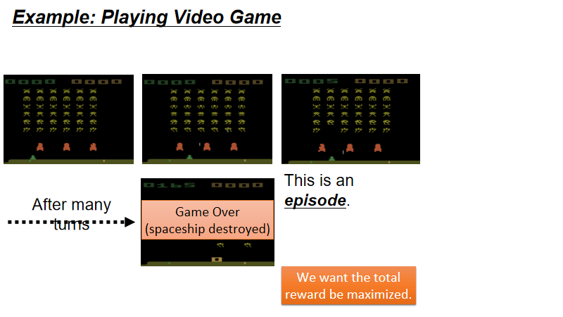

<head>

</head>

参考资料：[https://www.bilibili.com/video/av63546968?p=1](https://www.bilibili.com/video/av63546968?p=1)

[https://blog.csdn.net/ACL_lihan/article/details/104020259](https://blog.csdn.net/ACL_lihan/article/details/104020259)

##一、整体理解（深度强化学习）
&ensp;&ensp;在之前的没有明确何种强化学习的时候我学的一头雾水，在听完李弘毅老师的视频课之后，我将强化学习范围降到深度强化学习（深度学习+强化学习。

Fig1

&ensp;&ensp;在强化学习中，主要有三个部件(components)：actor(agent)、environment、reward function。其中env和reward function是事先就定好的，你不能控制的。唯一能调整的是actor的policy，使actor能获得最大的reward。

Fig2

&ensp;&ensp;policy是actor中起决策作用的一个东西，决定了actor的行为。就是说输入什么状态（state）要输出什么动作（action）。这里用$\pi$来代表policy。在**深度强化学习**中，policy通常使用network来实现，network中会包含很多参数，这里就用$\theta$来统一代表这些参数。
&ensp;&ensp;这里以游戏画面作为输入，经过红框的网络层（policy）决策后，得出采取各种动作的几率，所以最终得出做left这个动作。（类似于图像分类，看到什么图像，分成哪几类。只是这里的类别是要做出的动作）

##二、细化Fig2中的实例

Fig3

&ensp;&ensp;初始的游戏画面作为输入的状态s1，针对s1采取行动a1，根据奖励函数给出r1（有的视频中会记为r2），然后得到下一个画面s2。

Fig4

&ensp;&ensp;经过很多轮（s,a,r）后游戏在最终点结束了，从开始到结束玩的这一次游  戏称为一个episode（也称为游戏的轨迹trajec），将每一个episode的reward相加就能得到Total reward:$R=\sum\_{t=1}^Tr\_t$。actor的目标就是将 Total reward R 最大化。

Fig5

&ensp;&ensp;如Fig5所示在给定policy的参数$\theta$的情况下我们可以计算出每一个$\tau$存在的概率$p\_{\theta}\tau$,**这么理解**policy是一个网络，它的输出可以经过softmax后归一化，所以$p\_{\theta}(a\_i|s\_i)$是一个可求的概率分布。其中$p\_(s\_{t+1}|a\_t,s\_t)$代表的是environment，一般我们没办法控制这一部分。我们能控制的是采取不同的$\theta$（policy网络的参数），进而影响$p\_{\theta}(a\_t|s\_t)$，最终对$p\_{\theta}(\tau)$产生影响。

Fig6

&ensp;&ensp;给定一个$\tau$(一个游戏的随机路径)可以得到一局游戏的R，我们要做的就是调整actor中的参数，使得$R(\tau)$最大化。但是注意$R(\tau)$不是常量 scalable，而是随机变量 random variable，因为采取哪个action是有随机性的，而环境给出哪个state也是有随机性的。
&ensp;&ensp;所以对于R我们要算它的期望\bar{R}\_{theta}。穷举所有的$\tau$(trajectory)并计算每个$\tau$出现的概率，最后算$\sum\_{\tau}R(\tau)p\_{\theta}(\tau)$。**或者这样理解**：从$p\_{\theta}(\tau)$的分布中采样（sample）出一个$\tau$，然后计算$R\_{\tau}$的期望。很明显我们要做的就是最大化Expected Reward，所以可以采用**policy gradient**来做。
##三、policy gradient
&ensp;&ensp;**这里的策略梯度是指的梯度上升得到最大的奖励值，而不是之前在深度学习中用到的梯度下降使得loss最小**

Fig7

&ensp;&ensp;为了使的$\bar{R}\_{\theta}$最大化，我们需要做梯度上深（gradient ascent），即对$\bar{R}\_{\theta}$求梯度。但是$\bar{R}\_{\theta}$中的$R(\tau)$是不可微的（因为一个$R(\tau)$就是一个确定的值），所以我们需要一次sample出N个$\tau$(**这也是为什么Policy gradient最浪费时间的地方，因为更新完这次的参数之后，这N个样本就需要用新的$\theta$进行从新的替换**)，对每个$\tau$求$R({\tau}^n)\nabla logp\_{\theta}({\tau}^n)$，再求和取平均值

&ensp;&ensp;在式子$p\_{\theta}(\tau)=p(s\_1)\prod\_{t=1}^Tp\_{\theta}(a\_t|s\_t)p(s\_{t+1}|s\_t,a\_t)$，而$p(s\_{t+1}|s\_t,a\_t)$由环境所决定的，而且他与$\theta$无关，所以只能对$logp\_{\theta}({\tau}^n)$计算梯度，本质上就是对$p\_{\theta}(a\_t|s\_t)$计算梯度，所以将$R({\tau}^n)\nabla logp\_{\theta}({\tau}^n)$改写为$\sum\_{t=1}^{T\_n}R({\tau}^n)\nabla logp\_{\theta}(a\_t^n|s\_t^n)$，最后的$\frac{1}{N}\sum\_{n=1}^{N}\sum\_{t=1}^{T\_n}R({\tau}^n)\nabla logp\_{\theta}(a\_t^n|s\_t^n)$，若在$s\_t^n$下执行$a\_t^n$使得$R({\tau}^n)$为正值，则应该增加概率$p\_{\theta}(a\_t|s\_t)$，为负值则减少相应的概率值。

Fig8

&ensp;&ensp;如Fig8中的N个样本数据，这N组数据是通过actor与env进行交互获得的样本数据，用这些数据去更新模型的参数$\theta$。这些数据在更新完本次的$\theta$后即要抛弃，可通过新训练的参数去获得样本。(这于on-policy和off-policy有关)

Fig9

##四、改进Policy Gradient的两个Tips
###Tip1：add a baseline

Fig10

&ensp;&ensp;在Fig10中，蓝色的柱子代表在某一state下，采取三种动作的的概率$p\_{\theta}(a\_t|s\_t)$，绿色箭头则代表每种动作的Reward，长一些的箭头代表Reward比较大一些。在前面的篇幅中，我们介绍了假如执行某个行为a后R为正，则提高行为a出现的概率；R为负，则降低行为a出现的概率。

&ensp;&ensp;比如在pang的游戏中（下棋之类的）游戏中，执行什么动作得到的都是正的奖励值（0-20），则若s执行行为a之后R的增加量大了，那么行为a出现的概率就增加的大了；执行行为b之后R的增加量小了，那么行为b出现的概率就增加的大了。（注意在reward恒为正的情况下，看起来无论如何执行某 action 的概率都会增加，只是增加多少的问题） 因为所有action出现的概率和为1，那么在理想情况下，在归一化后相当于 行为a 出现概率上升而行为 b 出现概率下降。（即增加得少的归一化后概率相当于下降（蓝色的柱子变矮了），增加得多的归一化后才上升（蓝色的柱子变高了））。

&ensp;&ensp;为了解决这个问题，我们希望reward不要总是正值，如Fig10上侧的公式表示，我们将$R({\tau}^n)-b$，b是一个baseline，这样如果一个 reward 是一个很小的正值，减掉b后就会变负。我们可以假设$b=R(\tau)$的平均值来代替$b\simeq E(R(\tau))$

###Tip2：assign suitable credit

Fig11

由Fig11可知，在同一场游戏中，不管其中的某个行为是好是坏，总会乘上相同的权重R，这显然是不公平的。我们假设整场游戏的reward是+3，按规定其中三个$\nablalogp\_{theta}(a\_t^n|s\_t^n)$都要被乘上 3的权重，但是a3未必见得好，因为执行a3后的即时得分为-2。如果我们sample的次数够多，可能会看出a3不够好，这个问题能够得到解决。但是实际中可能没办法搜集足够多的数据，所以在sample次数不够多的情况下，我们希望每个action的权重不同。

Fig12

&ensp;&ensp;如Fig12所示不把整场游戏的R（+5+0+-2=+3作统一权重处理，而将执行该动作后剩下序列的【reward之和】作为该动作的权重。比如对于（sb,a2），它的权重应该为（+0-2=-2）。即执行某个行为前得到多少 reward 都跟该 action 无关，该 action 只影响之后的游戏过程。
&ensp;&ensp;所以把权重中的$R\{\tau}$换成$\sum\_{t'=t}^{T\_n}$(其中t代表该action执行的时刻，$T\_n$代表游戏结束的时刻，即把当前的r以及之后每一步的r做一个求和。

Fig13

&ensp;&ensp;还需要考虑的一点是，当前的action对之后游戏的影响会随之时间推移而减弱，所以我们要有discount，在求和的每一步都乘上一个小于1的$\gamma$（比如0.9），这样action之后的动作越多，即时分数乘上的$\gamma$越多，越往后得到reward就会打上更大的折扣。

&ensp;&ensp;我们把$R({\tau}^n)-b$这一项称作Advantage Function$A^{\theta}(s\_t,a\_t)$，也叫优势函数。它表示在actor在$s\_t$下采取$a\_t$，相较于其它action（同样对于$s\_t$）有多好。上标$\theta$代表采用参数为$\theta$的policy的actor。

