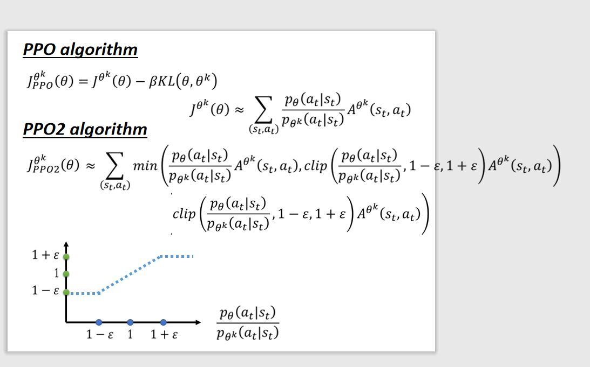

<head>

<script type="text/javascript" async src="https://cdnjs.cloudflare.com/ajax/libs/mathjax/2.7.0/MathJax.js?

参考资料：[https://www.bilibili.com/video/av63546968?p=1](https://www.bilibili.com/video/av63546968?p=1)

##一、On-Policy VS Off-Policy
###1、On-Policy：
&ensp;&ensp;当学习的agent和与环境交互的agent**是**同一个agent的时候，则称为On-Policy。我们每一收集的trajectory在更新policy参数$\theta$后，则这些sample被丢弃去用新的参数得到sample

###2、Off-Policy：
&ensp;&ensp;当学习的agent和与环境交互的agent**不是**同一个agent的时候，则称为Off-Policy。我们通过与环境交互得到的trajectory可以多次对学习的agent进行训练，避免了获取样本的复杂

Fig1

&ensp;&ensp;如Fig1所示，阿光自己下棋则可以看作是On-Policy，阿光看着佐为下棋则可以理解为Off-Policy

##二、On-Policy到Off-Policy的变换特征

###1、如何进行On-Policy到Off-Policy的过度

Fig2

&ensp;&ensp;如Fig2所示，我们将policy函数中的参数$\theta$用${\theta^'}$进行代替，我们就实现了从另外一个分布得到样本的目的。

###2、为何从另外一个分布中得出的样本可以训练当前分布参数呢？

Fig3

&ensp;&ensp;**Importance Sampling**方法，如图Fig3所示$x^i$为从分布p(x)抽取的样本，然后将样本$x^i$带入f(x)函数求值。我们可以将分布p(x)的分子分母分别乘上q(x)，我们将q(x)作为新的分布，则此时的x来自分布q(x)，p(x)/q(x)则作为权重修正项，这是一个重要的方法将On-Policy过度到Off-Policy的过程中。

Fig4

&ensp;&ensp;如Fig4所示，p(x)和q(x)这两者的分布函数不可以相差太大，在期望值上不会受到什么影响，但是在方差上怎会多了矫正的权重值，在Fig4中倒数第二行的公式展开将其乘上分布的概率q(x),则可以和分母约去一个q(x)，然后将分布切换为p(x)的分布可得到最后的式子。

Fig5

&ensp;&ensp;Fig5中展示了**Importance Sampling**方法存在的问题，当x服从原来的p(x)分布式，x大概率出现在左侧，此时f(x)的值大概率为负值；如果用q(x)代替p(x)进行采样，则f(x)的值为负值；此时两个分布的差别太大会影响训练的结果。**此问题我们在后面的PPO方法进行说明**

###3、On-Policy到Off-Policy的公式变化

Fig6

&ensp;&ensp;如图Fig6中则为将$p\_{\theta}$替代为$p\_{{\theta}^'}$

Fig7

&ensp;&ensp;Fig7中我们将$\frac{p\_{\theta}(S\_t)}{p\_{{\theta}^'}(S\_t)}$不容易计算的一项删去，最后得到的$J^{{\theta}^'}(\theta)$为我们要优化的式子，Fig7中倒数第二行的式子则为优化式子进行求导之后的式子。

##三、利用PPO方法避免**Importance Sampling**方法中p(x)和q(x)差别过大的问题

Fig8

&ensp;&ensp;如Fig8中所示$J^{{\theta}'}_{PPO}$为调整之后的式子，$KL({\theta},{\theta}')$并不是指两个分布参数之间的距离，它指的是在$\theta$和${\theta}'$下分别带入状态St得到的两个action之间的距离，这一计算也需要大量的sample出很多样本。

Fig9

Fig10

&ensp;&ensp;在$clip(\frac{p\_{\theta}(a\_t|s\_t)}{p\_{{\theta}'}(a\_t|s\_t)},1-\epsilon,1+\epsilon)$，它表示如果$\frac{p\_{\theta}(a\_t|s\_t)}{p\_{{\theta}'}$小于$1-\epsilon$时值为$1-\epsilon$，若\frac{p\_{\theta}(a\_t|s\_t)}{p\_{{\theta}'}$大于$1+\epsilon$时值为$1+\epsilon$，其它情况则直接选取值$\frac{p\_{\theta}(a\_t|s\_t)}$，通过这种限制的方式来控制两个分布p(x),q(x)之间的差异性.

Fig11
