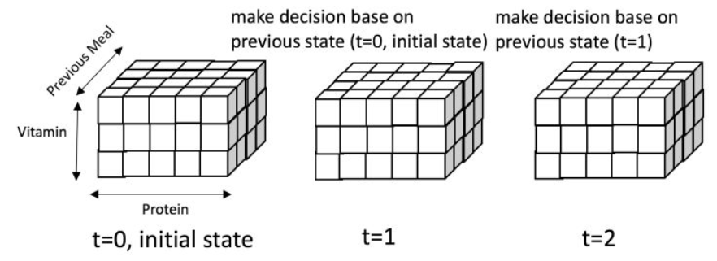

<head>

</head>

参考资料：[https://zhuanlan.zhihu.com/p/33117537](https://zhuanlan.zhihu.com/p/33117537 "参考知乎笔记")

## 一、背景回顾
### 1、假设我们开了一家叫Surprise Me的饭馆

1. 客人来了不用点餐，由算法从N道菜中选择一道菜推荐给客人
2. **菜的成分**可以表述为<蛋白质，维生素>
3. **用户的身体状况**可以表述为<蛋白质，维生素>
4. **优化目标**：最大化用户就餐次数
 - 如果推荐的菜一直能让用户**处于健康状态**，则用户会保持就餐（回头率高）
 - 如果推荐的菜使得用户**处于亚健康状态**（营养成分超标或不够），则会永远流失这个用户
 - 如果连续**两次推荐一样的菜**，则会永远流失这个用户

## 二、如何建模成强化学习问题
### 步骤1 刻画用户的状态 (State): 用户的状态可以表示成<蛋白质，维生素，上次就餐的菜>
1. 蛋白质正常范围为[1, 5]
2. 维生素的正常范围为[1, 3]

### 步骤2 刻画决策空间 (Action): 我们一共有4道菜，每道菜可以看成是一个Action，因此一共有4种Action
1. 菜1 ＝ <蛋白质: 0, 维生素: 1>
2. 菜2 ＝<蛋白质: 0, 维生素: 1> （跟菜1营养成分相同）
3. 菜3 ＝<蛋白质: 2, 维生素: 1>
4. 菜4 ＝<蛋白质: 2, 维生素: 1> （跟菜3营养成分相同）

### 步骤3 刻画Action对State的影响，i.e. P(State' | State, Action)
&ensp;&ensp;给定Action=某道菜，就餐后的State=<蛋白质 - 1 + 菜的蛋白质，维生素 - 1 + 菜的维生素，这次就餐的菜> ，-1表示从上次就餐到现在消耗了1个单位

### 步骤4 刻画Action带来的回报Reward，i.e. P(Reward | State, Action)
1. 如果推荐的菜(Action)使得用户保持健康，且跟上次的菜不重复，则就餐次数+1，即Reward=1
2. 如果推荐的菜(Action)使得用户变成亚健康状态，或者推荐了跟上次一样的菜，则用户永久离开，客户永远流失且Reward=0

### 步骤5 刻画优化标 = $\sum{Reward\_i}
&ensp;&ensp;如果客户流失，则Reward=0且不再会有后续的Reward。

## 三、状态 (State)、决策(Action)、马尔科夫决策过程(MDP)

### 1、从用户状态的定义可以看出，状态空间一共有三维，且每个维度都是离散取值的：

1. 维生素只有3种取值：{1, 2, 3}
2. 蛋白质只有5种取值：｛1, 2, 3, 4, 5｝
3. 上一顿吃的菜只有5种取值：{null, 1, 2, 3, 4}

### 2、由上可以得出整个状态空间可以用一个3*5*4的魔方表示，如下图所示

Fig1

### 3、上图中展示了一个客户来三次就餐情况
1. 第一次就餐 (t=0, initial state)
 - 用户的初始状态为 State=(蛋白质:3, 维生素:3, 上次就餐的菜: null)
 - 在这个例子中，我们推荐了菜4=(蛋白质: 2，维生素:1)
 - 用户的状态变为State'=(蛋白质:4，维生素:3，上次就餐的菜: 4)
2. 第二次就餐 (t=1)
 - 用户的状态State=(蛋白质:4，维生素:3，上次就餐的菜: 4)
 - 在这个例子中，我们推荐了菜1=(蛋白质:0, 维生素:1)
 - 用户的状态变为State'=(蛋白质: 3, 维生素: 3, 上次就餐的菜: 1)
3. 第三次就餐 (t=2)
 - 用户的状态State=(蛋白质:3, 维生素:3, 上次就餐的菜: 1)
 - 在这个例子中，我们推荐了菜4=(蛋白质: 2，维生素:1)
- 用户的状态变为State'=(蛋白质:4，维生素:3，上次就餐的菜:4)

&ensp;&ensp;**从上图的例子中可以观察**

1. **需要探索的状态空间是有限的**：第三次就餐产生的状态与第一次就餐产生的状态一模一样，我们可以借用第二次就餐的成功经验来处理第四次就餐

2. **马尔科夫决策过程 (MDP)**：Action的选取只依赖用户当前的状态，与之前的历史行为都没有关系，我们把这个决策过程称为马尔科夫决策过程(MDP)

### 4、一个问题如何满足马尔可夫性：
1. 极端情况下State可以是之前所有Action的集合S=(initial state, aciton1, action2, ... action_n)，可能与奖励的延迟有关（eg：在下棋时可能需要完成所有的操作才能评判）
2. 但是，状态State随着action的增大而不断增大，需要探索的状态空间变得无限大，无论有多少训练数据，都是无法解决的。**所以状态空间的有限性是至关重要的**。

### 5、MDP的核心问题
1. **状态空间State**：<蛋白质，维生素，上次就餐的菜>
 - 本文只考虑在有限离散空间（以后考虑连续空间、无限取值的情况）
2. **决策空间Action**: 推荐菜1、2、3、4
 - 本文只考虑有限离散取值（以后考虑连续、无穷限取值的情况)
3. **Action对State的影响 P(State' | State, Action)**
 - 本文认为(State, Action) -> State'的转换关系是已知的（以后考虑未知的情况，更加符合实际问题）
4. **Action带来的回报 P(Reward | State, Action)**
 - 本文认为(State, Action) -> Reward的关系是已知的（以后考虑未知情况，更加符合实际问题）
5. **初始状态 P(Initial State)**：
 - 一个从未光顾过餐馆的客户的营养状况是什么样的