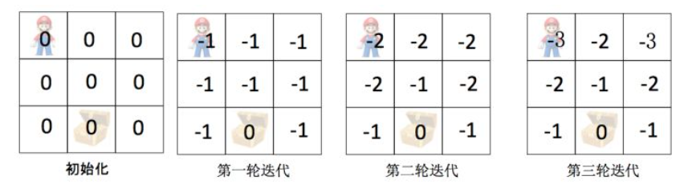

<head>

</head>

##一、马尔可夫决策过程
###1、 假设我们有一个3 x 3的棋盘：
1. 有一个单元格是超级玛丽，每回合可以往上、下、左、右四个方向移动
2. 有一个单元格是宝藏，超级玛丽找到宝藏则游戏结束，目标是让超级玛丽以最快的速度找到宝藏
3. 假设游戏开始时，宝藏的位置一定是(1, 2)

Fig1

###2、上图是一个标准的马尔可夫决策过程
1. **状态空间State**：超级玛丽当前的坐标
2. **决策空间Action**: 上、下、左、右四个动作
3. **Action对State的影响和回报 P(State', Reward | State, Action)**：本文认为该关系是已知的
 - 超级玛丽每移动一步，reward = -1
 - 超级玛丽得到宝箱，reward = 0并且游戏结束

##二、利用价值迭代 (Value Iteration) 求解马尔科夫决策过程
&ensp;&ensp;首先我们定义超级玛丽当前位置的价值 V(state)：从当前state =(x, y)开始，能够获得的最大化Reward的总和。

Fig2

&ensp;&ensp;**结合上图可以简单的理解价值迭代：**

1. 初始化：所有state的价值V(s) = 0
2. 第一轮迭代：对于每个state，逐一尝试上、下、左、右四个Action
 - 记录Action带来的Reward、以及新状态 V(s')
 - 选择最优的Action，更新V(s) = Reward + V(s') = -1 + 0
 - 第一轮结束后，所有状态都有V(s) = -1，即从当前位置出发走一步获得Reward=-1
3. 第二轮迭代：对于每个state，逐一尝试上、下、左、右四个Action
 - 记录Action带来的Reward、以及新状态 V(s')
 - 选择最优的Action，更新V(s) = Reward + V(s')
 - 对于宝箱周围的State，最优的Action是一步到达宝箱，V(s) = Reward + V(s') = -1 + 0
 - 对于其他State，所有的Action都是一样的，V(s) = Reward + V(s') = -1 + -1
 - 第二轮结束后，宝箱周围的State的价值保持不变 V(s) = -1，其他State的价值 V(s) = -2
4. 第三轮迭代：对于每个state，逐一尝试上、下、左、右四个Action
 - 记录Action带来的Reward、以及新状态 V(s')
 - 选择最优的Action，更新V(s) = Reward + V(s')
 - 对于宝箱周围的State，最优的Action是一步到达宝箱，V(s) = Reward + V(s') = -1 + 0
 - 对于宝箱两步距离的State，最优的Action是先一步到达宝箱周边的State，V(s) = Reward + V(s') = -1 + -1
 - 对于宝箱三步距离的State，所有Action都是一样的，V(s) = Reward + V(s') = -1 + -2
5. 第四轮迭代：对于每个state，逐一尝试上、下、左、右四个Action
 - 记录Action带来的Reward、以及新状态 V(s')
 - 选择最优的Action，更新V(s) = Reward + V(s')
 - 对于宝箱周围的State，最优的Action是一步到达宝箱，V(s) = Reward + V(s') = -1 + 0
 - 对于宝箱两步距离的State，最优的Action是先一步到达宝箱周边的State，V(s) = Reward + V(s') = -1 + -1
 - 对于宝箱三步距离的State，最优的Action是所有Action都是一样的，V(s) = Reward + V(s') = -1 + -2
 - 在第四轮迭代中，所有V(s)更新前后都没有任何变化，价值迭代已经找到了最优策略

&ensp;&ensp;上面挂的迭代过程运用了贝尔曼方程，对每个位置价值进行更新，状态s的价值V(s)由两部分组成（采取action=a后带来的reward，以及采取action=a后到达的新的状态的价值V(s')）
$$V\_*(s)=max\_a \sum\_{s^/,r}p(s,r|s,a)[r+\gamma V\_ \ast(s^/)]$$

##三、价值迭代的适用场景
使用价值迭代求解MDP问题时，需要满足一下条件：

1. Action对State的影响和回报 P(State', Reward | State, Action)是已知的，然而绝大多数实际问题中P(State', Reward | State, Action)是未知的

2. State和Action都是离散取值，无法应对Action或者State是连续取值的

3. State和Action都是低维度离散取值，因为计算复杂度是随着维度的升高而迅速变大的—— O(|State| x |Action| x |State|)

##四、价值迭代VS策略迭代

Fig3

把策略迭代和价值迭代放在一起，可以把Value Iteration看成是简化的Policy Iteration：
在Policy Iteration中
第一步 Policy Eval：一直迭代至收敛，获得准确的V(s)
第二步 Policy Improvement：根据准确的V(s)，求解最好的Action
对比之下，在Value Iteration中
第一步 "Policy Eval"：迭代只做一步，获得不太准确的V(s)
第二步 "Policy Improvement"：根据不太准确的V(s)，求解最好的Action
本质上，Policy Iteration和Value Iteration都属于Model-based方法，这种方法假设我们知道Action带来的Reward和新状态，即P(s', reward | s, a)。最明显的特点是，不用玩迷宫游戏，便能根据转移矩阵计算出最优策略。

**注：**Model-free方法，不需要事先知道P(s', reward | s, a)，经典的方法包括Q-Learning和SARSA

##四、代码理解
[https://link.zhihu.com/?target=https%3A//github.com/whitepaper/RL-Zoo/blob/master/value_iteration.ipynb](https://link.zhihu.com/?target=https%3A//github.com/whitepaper/RL-Zoo/blob/master/value_iteration.ipynb "代码理解")

    class Agent:
    def __init__(self, env):
        self.env = env
        self.V = np.zeros(env.nS)

    def next_best_action(self, s, V):
        action_values = np.zeros(env.nA)
        for a in range(env.nA):
            for prob, next_state, reward, done in env.P[s][a]:
                action_values[a] += prob * (reward + DISCOUNT_FACTOR * V[next_state])
        return np.argmax(action_values), np.max(action_values)

    def optimize(self):
        THETA = 0.0001
        delta = float("inf")
        round_num = 0

        while delta > THETA:
            delta = 0
            print("\nValue Iteration: Round " + str(round_num))
            print(np.reshape(self.V, env.shape))
            for s in range(env.nS):
                best_action, best_action_value = self.next_best_action(s, self.V)
                delta = max(delta, np.abs(best_action_value - self.V[s]))
                self.V[s] = best_action_value
            round_num += 1

        policy = np.zeros(env.nS)
        for s in range(env.nS):
            best_action, best_action_value = self.next_best_action(s, self.V)
            policy[s] = best_action

        return policy