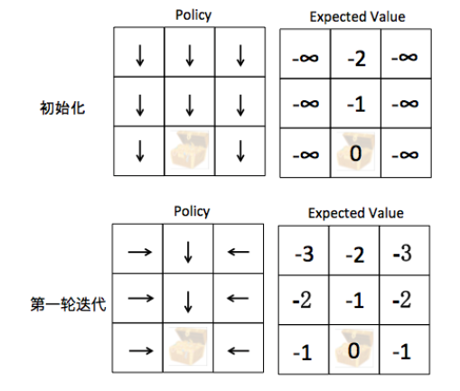
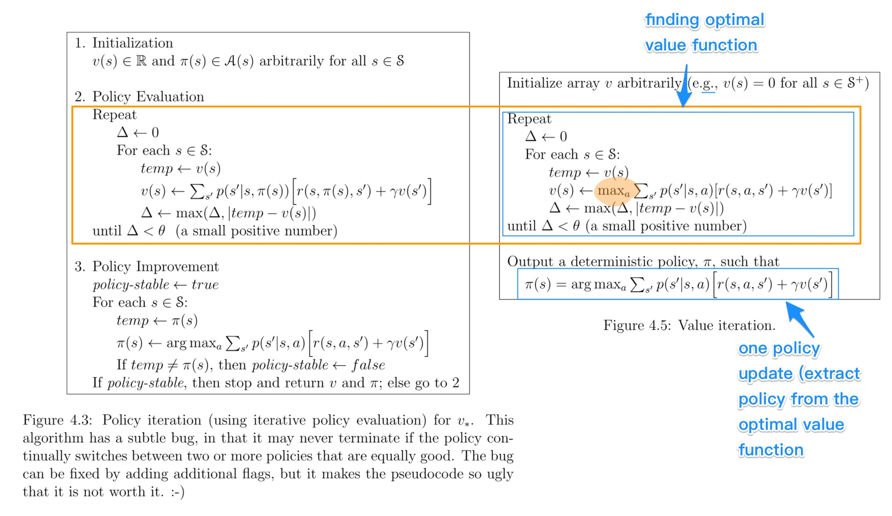

<head>

</head>

##一、马尔可夫决策过程
###1、 假设我们有一个3 x 3的棋盘：
1. 有一个单元格是超级玛丽，每回合可以往上、下、左、右四个方向移动
2. 有一个单元格是宝藏，超级玛丽找到宝藏则游戏结束，目标是让超级玛丽以最快的速度找到宝藏
3. 假设游戏开始时，宝藏的位置一定是(1, 2)

Fig1

###2、上图是一个标准的马尔可夫决策过程
1. **状态空间State**：超级玛丽当前的坐标
2. **决策空间Action**: 上、下、左、右四个动作
3. **Action对State的影响和回报 P(State', Reward | State, Action)**：本文认为该关系是已知的
 - 超级玛丽每移动一步，reward = -1
 - 超级玛丽得到宝箱，reward = 0并且游戏结束

##二、利用策略迭代 (Value Iteration) 求解马尔科夫决策过程

###1、策略迭代的相关定义：
1. 什么叫策略？策略就是根据当前状态决定该采取什么Action，$\pi(s)~P(Action|State)$
 - 以本文超级玛丽寻找宝箱为例，超级玛丽需要不断朝着宝箱的方向前进
 - 当前状态在宝箱左侧，策略应该是朝右走 
 - 当前状态在宝箱上方，策略应该是超下走
2. 如何衡量策略的好坏——策略评估(Policy Evaluation)
 - 类似于价值函数，给定一个策略，我们可以计算出每个状态的期望价值 V(s)
3. 如何找到更好的策略——策略迭代(Policy Iteration)
 - 初始化：随机选择一个策略作为初始值，比如说不管什么状态，一律朝下走，即P(Action = 朝下走 | State) = 1，P(Action = 其他Action | State) = 0
 - 第一步 策略评估 (Policy Evaluation)：根据当前的策略计算V(s)
 - 第二步 策略提升 (Policy Improvement)：计算当前状态的最好Action，更新策略，  
 $$\pi(s)=argmax\_a \sum\_{s^/,r}(r+\gamma V(s^/))$$
 - 不停的重复策略评估和策略提升，直到策略不再变化为止

Fig2

&ensp;&ensp;下面以寻找宝藏为例，说明策略的迭代过程：

1. 初始化：无论超级玛丽在哪个位置，策略默认为向下走
 - **策略评估：计算V(s)**
 - &ensp;&ensp;如果宝藏恰好在正下方，则期望价值等于到达宝藏的距离(-2或者-1）
 - &ensp;&ensp;如果宝藏不在正下方，则永远也不可能找到宝藏，期望价值为负无穷
 - **策略提升：根据V(s)找到更好的策略**
 - &ensp;&ensp;如果宝藏恰好在正下方，则策略已经最优，保持不变
 - &ensp;&ensp;如果宝藏不在正下方，根据$argmax\_a \sum\_{s^/,r}(r+\gamma V(s^/))$可以得出最优策略为横向移动一步
2. 第一轮迭代：通过上一轮的策略提升，这一轮的策略变成了横向移动或者向下移动（如图所示)
 - **策略评估：计算V(s)**
 - &ensp;&ensp;如果宝藏恰好在正下方，则期望价值等于到达宝藏的距离(-2或者-1）
 - &ensp;&ensp;如果宝藏不在正下方，当前策略会选择横向移动，期望价值为-3, -2, -1(这里默认$\gamma$的值为1)
 - **策略提升：根据V(s)找到更好的策略**
 - &ensp;&ensp;如果宝藏恰好在正下方，则策略已经最优，保持不变
 - &ensp;&ensp;如果宝藏不在正下方，根据$argmax\_a \sum\_{s^/,r}(r+\gamma V(s^/))$可以得出当前策略已经最优，保持不变

##三、价值迭代的适用场景
&ensp;&ensp;使用策略迭代求解MDP问题时，需要满足一下条件（跟价值迭代的应用条件非常类似）：

1. Action对State的影响和回报 P(State', Reward | State, Action)是已知的，然而绝大多数实际问题中P(State', Reward | State, Action)是未知的
2. State和Action都是离散取值，无法应对Action或者State是连续取值的
3. State和Action都是低维度离散取值，因为计算复杂度是随着维度的升高而迅速变大的—— O(|State| x |Action| x |State|)

##四、价值迭代VS策略迭代

Fig3

&ensp;&ensp;把策略迭代和价值迭代放在一起，可以把Value Iteration看成是简化的Policy Iteration：(没有策略指导就得一步步的进行循环，有策略指导可以很快的知道往哪个方向走)

1、在Policy Iteration中

1. 第一步 Policy Eval：一直迭代至收敛，获得准确的V(s)
2. 第二步 Policy Improvement：根据准确的V(s)，求解最好的Action

2、对比之下，在Value Iteration中

1. 第一步 "Policy Eval"：迭代只做一步，获得不太准确的V(s)
2. 第二步 "Policy Improvement"：根据不太准确的V(s)，求解最好的Action

&ensp;&ensp;本质上，Policy Iteration和Value Iteration都属于Model-based方法，这种方法假设我们知道Action带来的Reward和新状态，即P(s', reward | s, a)。**最明显的特点是，不用玩迷宫游戏，便能根据转移矩阵计算出最优策略。**

**注：**Model-free方法，不需要事先知道P(s', reward | s, a)，经典的方法包括Q-Learning和SARSA

##五、代码理解
[https://link.zhihu.com/?target=https%3A//github.com/whitepaper/RL-Zoo/blob/master/policy_iteration.ipynb](https://link.zhihu.com/?target=https%3A//github.com/whitepaper/RL-Zoo/blob/master/policy_iteration.ipynb "代码理解")

    class Agent:
    def __init__(self, env):
        self.env = env

    def policy_evaluation(self, policy):
        V = np.zeros(self.env.nS)
        THETA = 0.0001
        delta = float("inf")
        
        while delta > THETA:
            delta = 0
            for s in range(self.env.nS):
                expected_value = 0
                for action, action_prob in enumerate(policy[s]):
                    for prob, next_state, reward, done in self.env.P[s][action]:
                        expected_value += action_prob * prob * (reward + DISCOUNT_FACTOR * V[next_state])
                delta = max(delta, np.abs(V[s] - expected_value))
                V[s] = expected_value
        
        return V
    
    def next_best_action(self, s, V):
        action_values = np.zeros(env.nA)
        for a in range(env.nA):
            for prob, next_state, reward, done in self.env.P[s][a]:
                action_values[a] += prob * (reward + DISCOUNT_FACTOR * V[next_state])
        return np.argmax(action_values), np.max(action_values)
    
    def optimize(self):
        policy = np.tile(np.eye(self.env.nA)[1], (self.env.nS, 1))
        
        is_stable = False
        
        round_num = 0
        
        while not is_stable:
            is_stable = True
            
            print("\nRound Number:" + str(round_num))
            round_num += 1
            
            print("Current Policy")
            print(np.reshape([env.get_action_name(entry) for entry in [np.argmax(policy[s]) for s in range(self.env.nS)]], self.env.shape))
            
            V = self.policy_evaluation(policy)
            print("Expected Value accoridng to Policy Evaluation")
            print(np.reshape(V, self.env.shape))
            
            for s in range(self.env.nS):
                action_by_policy = np.argmax(policy[s])
                best_action, best_action_value = self.next_best_action(s, V)
                # print("\nstate=" + str(s) + " action=" + str(best_action))
                policy[s] = np.eye(self.env.nA)[best_action]
                if action_by_policy != best_action:
                    is_stable = False
            
        policy = [np.argmax(policy[s]) for s in range(self.env.nS)]
        return policy