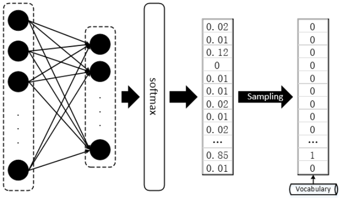
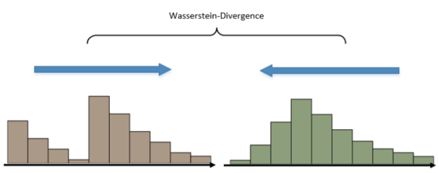
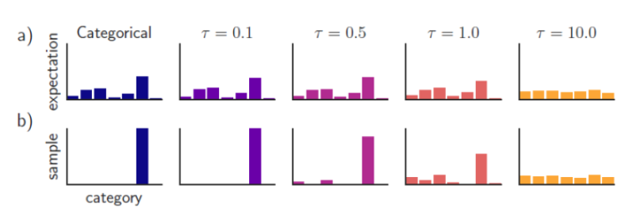

<head>

</head>
###一、GAN处理NLP时的困境
&ensp;&ensp;GAN的作者在原论文中提出GAN仅仅适用于连续数据的生成，对于离散型的数据处理效果不佳，文本数据是一种典型的离散型数据。
**1、如何区别离散型数据和连续性数据？ **
&ensp;&ensp;对于图像数据则是典型的连续性数据，因此GAN可以直接生成出逼真的画面来。图像数据在计算机中均被表示为矩阵，若是黑白图像矩阵中元素的值即为像数值或者灰度值，就算是彩色图像，图像张量即被多加了一阶用于表示RGB通道，图像矩阵中的元素是可微分的，其数值直接反映出图像本身的明暗，色彩等因素，很多这样的像素点组合在一起，就形成了图像，也就是说，从图像矩阵到图像，不同的像数值就代表着不同的颜色，每个数值都有其确定的意义。

&ensp;&ensp;对于文本数据而言就不同了，文本中通常使用的是不同维度的词库来进行表示，假设我们的词库大小为600，那么每当我们预测下一个出现的词时，理应得到的是一个One-hot的Vector，这个Vector中有599项是0，只有一项是1，而这一项就代表词库中的某个词。然而，真正的隔阂在于，我们每次用无论什么分类器或者神经网络得到的直接结果，都是一个600维的概率分布，而不是一个One-hot的Vector，即便是使用softmax作为输出，也只能得到某一维上特别大，其余维度上特别小的情况，而将这种输出结果过渡到One-hot vector 然后再从词库中查询出对应index的词，通常，我们找出值最大的那一项设其为1，其余为0。

**2、通用梯度求导在离散处理中的问题？**

&ensp;&ensp;神经网络的优化方法大多数都是基于梯度的(Gradient based)，很多文献中提到：GAN在面对离散型数据时，判别网络无法将梯度Back propagation（BP）给生成网络。基于梯度的优化方法大概意思是微调网络中的参数（weight），看看最终输出的结果有没有变得好一点，有没有达到最好的情形。但是判别器D得到的是Sampling之后的结果，也就是说，我们经过参数微调之后，即便softmax的输出优化了一点点，比如上图的例子中，正确结果本应是第三项，其output的倒数第二项从 变为了 ，第三项从 变为了 ，但是经过Sampling之后，生成器G输出的结果还是跟以前一模一样，并再次将相同的答案重复输入给判别器D，这样判别器D给出的评价就会毫无意义，生成器G的训练也会失去方向。

&ensp;&ensp;如果我们每次给判别器D直接吃Sampling之前的结果，也就是softamx输出的那个distribution，同样，这么做也有很大的问题。在GAN的基本原理中，判别器D的初衷，它经历训练就是为了准确辨别生成样本和真实样本的，那么生成样本是一个充满了float小数的分布，而真实样本是一个One-hot Vector，判别器D很容易“作弊”，它根本不用去判断生成分布是否与真实分布更加接近，它只需要识别出给到的分布是不是除了一项是1，其余都是0即可。所以无论Sampling之前的分布无论多么接近于真实的One-hot Vector，只要它依然是一个概率分布，都可以被判别器D轻易地检测出来。

###二、改进GAN用于文本生成
**1、Wasserstein-divergence**

&ensp;&ensp;在Wasserstein GAN之前有一篇论文中提出了f-GAN,f代指了任何一种divergence，可以将f理解为KL-Divergence，JS-Divergence，Wasserstein-Divergence，f-GAN被定义为$\\ D_f(p||q)=\int_{x}q(x)f(\frac{p(x)}{q(x)})dx$，公式中的f(.)被称为f函数，他必须满足以下要求：f是凸函数，f(1)=0；将不同的f函数效果进行了对比。

&ensp;&ensp;Wasserstein GAN对GAN的改进也是从替换KL-Divergence这个角度对GAN进行改进，总的来说，WGAN采用了一种奇特的 Divergence，“推土机-Divergence”， 将两个分布看作两堆土，Divergence 计算的就是为了将两个土堆推成一样的形状所需要泥土搬运总距离。使用Wasserstein-Divergence训练的GAN相比原版的GAN有更加明显的“演化”过程，WGAN的训练比GAN更能体现中间变化的过程，因为在JS散度中，返回值不是log2，就是0。通过WGAN，鉴别器D就看可以每次将output的值更进一步的被传回来了。

**2、Gumbel-softmax（耿贝尔-softmax）**

&ensp;&ensp;“耿贝尔”softmax主要用来处理之前的GAN输出为离散型而无法进行可微分的特性。耿贝尔softmax的直接输出既可以保证与真实分布的重叠，又能避免采样操作对于其可微特征的破坏。

&ensp;&ensp;在之前的采样过程中，argmax()函数将普通的softmax的输出转化为One-hot Vector:$y=one_hot(argmax(softmax(h)))$
,而Gumbel-Softmax略去了one_hot(.)+argmax(.)这一步，能够直接给出近似Sampling操作的输出：$\\ y=softmax(1/\tau(h+g))$,精髓在于这其中的“逆温参数”$\tau$，当$\tau$趋于0时，上式所输出的分布等同于one_hot(.)+argmax(.)给出的 Sampling分布，而当$\tau$趋于无穷时，上式的输出就接近于均匀分布，而 则作为这个特殊softmax中的一个超参数，给予一个较大的初始值，通过训练学习逐渐变小，向0逼近。

###三、强化学习与GAN文本生成
结合下一篇seqGAN进行学习