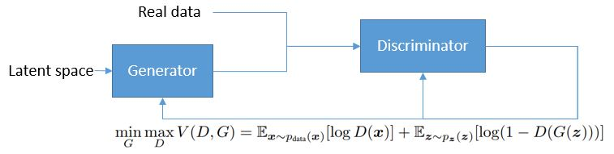
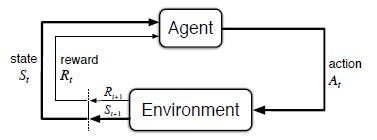

<head>

</head>

##一、GAN简介
&ensp;&ensp;GAN属于无监督学习，由两个神经网络组成。生成器（generator）从潜在空间中随机获取样本，并与真实数据一起作为判别器（discriminator）的输入。判别器是一个经典的分类器，作用是把真实数据和训练数据尽量分开。判别器对生成的数据的判别结果会返回给生成器，训练生成器生成更多可以成功“骗过”判别器的数据。训练的最终目的是使得生成样本的分布与真实数据达到一致，判别器完全不能区分真伪。
&ensp;&ensp;论文中把生成器和判别器的对抗描述为一个双人的零和游戏

Fig1

&ensp;&ensp;其中D代表判别器Discriminator，G代表生成器Generator。D的目标是最大化信息熵（entropy），G的目标是最小化log(1-D(G(z)))
&ensp;&ensp;GAN的设计要求生成器的输出是一个连续空间，否则D到G(z)的梯度无法指导G的修正方向。SeqGAN尝试使用强化学习中的策略梯度（policy gradient）的方法解决离散空间样本的对抗生成。

##二、强化学习简介
&ensp;&ensp;已知状态State(S)和可能的行为Action(A)，通过强化学习把状态映射到最佳行为，达到最大化某个特定奖励值reward的目的。这是一个闭环系统，行为影响结果，同时结果会给下一次选择提供反馈。强化学习可以通过记忆解决一些反馈时间较长的问题。在这个闭环系统里不需要存在外部监督，也就是对于行为的选择可以完全来自于结果反馈。

Fig2

###1、有限的马尔可夫决策链
&ensp;&ensp;对强化学习系统的数学建模依赖于马尔可夫链的属性

$P\_r$ { $S\_{t+1}=s^/,R\_{t+1}=r|S\_0,A\_0,R\_1,...S\_{t-1},A\_{t-1},R\_t,S\_t,A\_t $ } $\simeq P\_r ${$S\_{t+1}=s^/,R\_{t+1}=r|S\_t,A\_t$}

&ensp;&ensp;任何一个马尔科夫状态都包含了它的历史状态的信息。这一点对于强化学习尤其重要，因为参数值和决策值默认只与当前状态有关。由以上马尔可夫属性可以得出：
由以上马尔科夫属性可以得出：
给定状态-行为对(s,a)，得到下一个状态和当前行为的奖励(s’,r)的概率为

$p(s',r|s,a) \simeq P\_r$ { $ S\_{t+1}=s^/,R\_{t+1}=r|S\_t=s,A\_t=a$}

&ensp;&ensp;奖励值reward的计算：

$r(s,a) \simeq E[R\_{t+1}|S\_t=s,A\_t=a] = \sum\_{r \in R} \sum\_{s' \in S}p(s',r|s,a)$

&ensp;&ensp;状态转移矩阵：

$p(s'|s,a) \simeq \sum{r \in R}p(s',r|s,a)$

&ensp;&ensp;policy $\pi$的行为价值

$q\_\pi(s,a) \simeq E\_\pi[\sum\_{k=0}^{\infty}\gamma^kR\_{t+k+1}|S\_t=s,A\_t=a]$

&ensp;&ensp;policy $\pi$的状态价值（这个公式又叫Bellman 等式，这种等式表明了当前值和它的后续值之间的迭代关系。）

$v\_\pi(s) = \sum\_a\pi(a|s)\sum\_{s',r}[r+\gamma v\_\pi(s')]$

###2、Q-learning
&ensp;&ensp;Q-learning是强化学习中的off-policy temporal difference control算法中的一种，off-policy指学习的参数并不是policy本身，而是行为价值Q。Temporal difference指这是一种monte carlo加bootstrapping方法，通过随机抽样历史状态-行为对，模拟可能结果并通过对历史“记忆”的重现修正对实际分布的判断。Contol指对于Q值的学习是exploratory（比如用epsilon-greedy方法），而对于policy的学习是完全greedy的（比如选取Q值最大的行为）。
&ensp;&ensp;一个状态-行为对的价值Q可以迭代表示为：
$$Q\_t(S\_t,A\_t) = Q\_{t-1}(S\_{t-1},A\_{t-1})+\frac{1}{N}(R\_t+\gamma*max\_aq\{t-1}(S\_t)-Q\_{t-1}(S\_{t-1},A\_{t-1}))$$
&ensp;&ensp;该算法再计算当前时刻的行动-状态价值$Q\_t(S\_t,A\_t)$时选择了当前状态使价值最大的行动$max\_AQ\_{t-1}(S\_t)$，上式中的1/N可以用$\alpha$表示，$\alpha$越大学习越快，但是在靠近极限值的位置有可能不收敛。$\gamma$是历史数据的延迟因素，它越大历史数据越不重要。

###3、策略梯度（Policy Gradient）
&ensp;&ensp;有别于off-plicy的各种方法，policy gradient是对策略的直接学习：通过梯度下降方法，找到一组参数$\theta^*$，最大化策略奖励值得预期$J(\theta)=E\_{\pi}[r(\tau)]$，其中$\tau$代表马尔可夫链上得一个可能得路径，包含了一组(s,a,r)的序列；$r(\tau)$代表这条路径的奖励值之和。
&ensp;&ensp;而预期奖励值的梯度$\nabla E\_{\pi\_{\theta}}[r(\tau)]=E\_{\pi\_{\theta}}[r(\tau)\nabla log\pi\_{\theta}(\tau)]$
&ensp;&ensp;其中$\pi\_{\theta}(\tau) = P(s\_0)\prod\_{t=1}^T\pi\_theta(a\_t|s\_t)p(s\_{t+1},r\_{t+1}|s\
_t,a\_t)$
