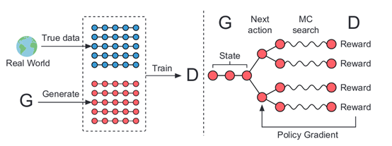
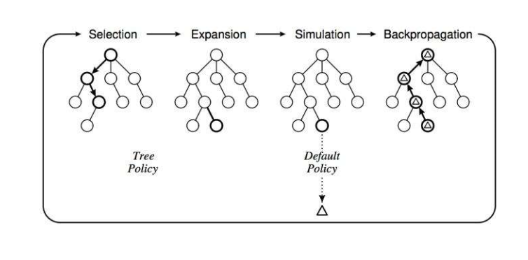
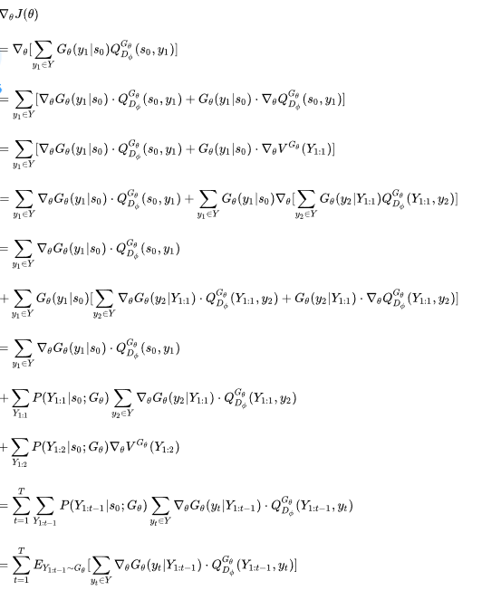
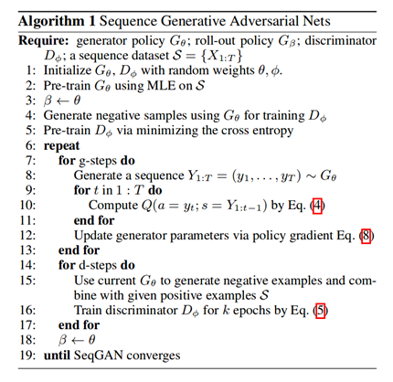

<head>

</head>

参考链接：[https://zhuanlan.zhihu.com/p/79720987](https://zhuanlan.zhihu.com/p/79720987 "公式推导")

##一、简要信息
&ensp;&ensp;生成序列的生成的数据模拟真实数据是一个重要的问题在无监督学习中。最近，带有LSTM记忆细胞的循环神经网络已经在自然语言生成到手写文本生成展示了优异的结果。大多数训练RNN的方法是给定之前观察到的数据，最大化训练序列中每个真实数据的对数预测可能性。然而极大似然的方法可能在序列推理的阶段带来“**exposure bias**”（RNN 在 训练(training) 时接受的标签是真实的值(ground truth input)，但测试 (testing) 时却接受自己前一个单元的输出(output)作为本单元的输入(input)，这两个setting不一致会导致误差累积error accumulate误差累积是因为，你在测试的时候，如果前面单元的输出已经是错的，那么你把这个错的输出作为下一单元的输入，那么理所当然就是“一错再错”，造成错误的累积。）。为了解决问题提出了一个叫计划抽样的训练策略，它在训练阶段生成模型用自己生成的数据作为输入的前缀（观测到的单词）而不是决定下一个单词时用真实数据决定。可惜计划采样序列是一个非连续性的训练策略。另一个训练差异问题的方法是在完整的生成序列上建立损失函数。在实例机器翻译中就比较方便进行损失和得分的计算，在诗歌生成和聊天机器人方面就很难准确的计算。

&ensp;&ensp;广泛的实验基于生成和真实的数据进行了调查的有效性和性质提出的SeqGAN。在生成的数据中（诗歌生成，对话生成、音乐生成），seqGAN优于极大似然方法、极大采样方法和PG-BLEU方法。

###

##二、摘要与引言
&ensp;&ensp;GAN是一种新的方法（在2017年）用来训练生成模型在生成真实数据方面已经取得了很大的成功，但是当目标是生成离散标记序列时它有局限性。**局限性**的主要原因在于GAN在生成连续离散序列时会遇到**两个问题**：

1. GAN用于生成实值连续数据，但是在生成器的输出是离散的，梯度更新从判别器传到生成器比较困难(可能每次只能生成一个单词，而判别器需要的是一整句话)；
2. 判别器只有当序列被完全生成后才能进行判断，但此刻指导用处已不太大，而如果生成器生成序列的同时判别器来判断，**如何平衡当前序列的分数和未来序列的分数又是一个难题**（就是达不到一个完整句子长度的时候该如何评判）。

&ensp;&ensp;在这篇论文中，我们提出了一个序列生成模型——SeqGAN，来解决上述这两个问题。作者将生成器看作是强化学习中的stochastic policy（一个网络），这样 SeqGAN就可以直接通过 gradient policy update 避免生成器中的微分问题。同时，判别器对整个序列的评分（对生成序列的概率值）作为强化学习的奖励信号可以通过 Monte Carlo 搜索传递到序列生成的中间时刻。具体来说，作者将**生成器生成序列的过程**看做是一个强化学习中的**序列决策过程**（决定生成哪些单词的行为，可以理解为在迷宫游戏中你决定走的下一步是哪里）。生成模型被看作一个 agent，目前为止已生成的序列表示当前 state，下一个要生成的单词则是采取的 action，判别模型对序列的评价分数则是返回的reward。

##三、相关工作与主要贡献
&ensp;&ensp;DBN（对比散度算法）和DAE（去噪自编码技术）均是学习一个每一个数据实例的低维向量的编码技术，然后生成数据从解码网络中。VAE（差分自编码）结合深度学习和统计推理去表示数据实例在一个潜在的隐藏空间中，然而依然使用深度神经网络对于非线性的映射。所有的生成模型通过最大化训练数据的相似性，复杂概率的计算是这类训练的问题。

&ensp;&ensp;Goodfellow and others在2014年提出了另外一种生成模型的替代训练方法GAN网络，他是一种最大最小化在生成模型和鉴别模型之间的问题。但是GAN网络被设计去处理的是输出为连续的数据而不是离散的数据。另一方面，RNN在许多应用中可以训练生成词的序列。目前最流行的训练RNNs的方法是最大化训练数据中每个词的可能性，然而被指出这种方法在训练集和生成词之间存在较大的差异性。最后证实GANs具有很大的潜力，但目前还不能应用于离散概率模型。

&ensp;&ensp;序列数据生成可以被表述为序列决策的过程，这个过程可以通过强化学习的技术潜在的解决。将序列生成器建模为选择下一个词的策略，一旦有(隐式)奖励函数来指导策略，可以采用策略梯度法(Sutton et al. 1999)来优化生成器。在需要完整结果才能进行评估的样例中，我们可以采用Monte Carlo搜索进行状态行为评估。我们提出的seqGAN使用基于强化学习得生成序列去扩展GAN，在每一个集合结束时，鉴别器通过蒙特卡洛方法提供一个奖励信号，而生成器使用估计的总体奖励来选择行动并学习策略

###1、序列生成对抗网络
&ensp;&ensp;先给定一些真实的训练数据集记为$p\_{data}$，训练以$\theta$为参数的生成模型$G\_{\theta}$,生成序列$Y\_{1:T}=(y\_1,....,y\_t,....y\_T)$，$y\_t \in Y$，Y是词典。如果将这个问题从强化学习的角度进行思考，在时间步t，状态s是当前已生成序列$(y\_1,....,y\_{t-1})$ ，动作a是下一个单词$y\_t$的选择，策略policy是生成器$G\_{\theta}(y\_t|Y\_{1:t-1})$，当下一步动作选择之后，状态转换是确定的，即${\delta}^a\_{s,s'}=1$(当前状态为$s=Y\_{1:t-1}$，动作$a=y\_t$，下一个状态$s'=Y\_{1:t}$)；如果下一步是其它的状态s"，则${\delta}^a\_{s,s"}=0$

&ensp;&ensp;训练以$\phi$为参数的判别模型，指导生成器G的生成。$D\_{\phi}(Y\_{1:T})$表示序列$Y\_{1:T}$来自真实数据中的概率。

Fig2

&ensp;&ensp;Fig2中的左侧为判别器的训练，通过输入来自真实数据的正样例和来自生成器生成的负样例从而训练（**插入原始GAN鉴别器的损失函数，主要来源于binary cross-entropy loss：**，$L(x^{(i)},y^{(i)}) = -y^{(i)}\cdot log(P(x^{(i)})) - (1-y^{(i)})\cdot log(1-P(x^{(i)}))$,其中y为真实标签，取1(正样本)或者0(负样本)，P(x)为x属于正样本的概率。），判别器由CNN组成；Fig2图中的右侧是生成器的训练，通过将判别器判别的概率回传给生成器从而训练（**插入原始GAN生成器的损失函数：**，$L\_{d\_{fake}}(G(z^{(i)}),y^{(i)}=0) = -log(1-D(G(z^{(i)})))$，这个损失越大，意味着判别器的性能越差，同时也意味着生成器的性能越好。也就是说，我们希望**朝着增大该损失**的方向来调整生成器的参数。如果采用梯度下降优化生成器，也就是要减小它的相反数，即生成器的损失函数：$L\_{d\_{fake}}(G(z^{(i)}),y^{(i)}=0) = log(1-D(G(z^{(i)})))$，对其中的参数求导即可），这里使用了 Monte Carlo search 和 policy gradient 方法。$G\_{\theta}$是用来生成t时刻的行为$a\_t$然后得到了状态$s\_t$， Monte Carlo search负责在t时刻之后的T-t时刻的状态补全问题。

###2、Policy Gradient的使用（可以理解Policy为一个网络）
&ensp;&ensp;**生成模型（policy）**$G\_{\theta}(y\_t|Y\_{1:t-1})$的目标是最大化期望奖励$J(\theta)=E[R\_T|s\_0,\theta]=\sum\_{y\_1 \in Y}G\_\theta(y\_1|s\_0)\cdot Q\_{D\_{\phi}}^{G\_{\theta}}(s\_0,y\_1)$，但是其中的$R\_T$是完全生成序列的奖励，来自判别器$D\_{\phi}$，$Q\_{D\_{\phi}}^{G\_{\theta}}(s,a)$是**整个序列的**action-value function，表示从状态s开始，依据策略$G\_{\theta}$采取动作a，**直到结束所得到的期望累计奖励啊**。综上，最重要的是如何计算action-value function。

&ensp;&ensp;在这篇论文中，作者将判别器$D\_{\phi}(Y\_{1:T}^n)$判断序列$Y\_{1:T}^n$为真的概率作为奖励$Q\_{D\_{\phi}}^{G\_{\theta}}(a=y\_T,s=Y\_{1:T-1})=D\_{\phi}(Y\_{1:T})$；但是，前面已经说明，判别器只能当序列被完全生成之后才能返回一个奖励**因为我们在每一个时间步上，真正关心的是长期的收益，所以我们不仅应该考虑已生成序列的效果，也要考虑接下来生成的结果**（在当下考虑未来），这就好比在下棋时，我们会适当放弃一些眼前优势从而追求长远的胜利。因此，为了估计**中间时间步上的 action-value**，我们使用** Monte Carlo 搜索 和 roll-out policy  $G\_{\beta}$(这和生成器的参数不同)来对剩下的$T-t$个未知单词进行采样（补全句子）**。我们将这个N次Monte Carlo搜索过程表示为${Y\_{1:T}^1,....,Y\_{1:T}^N}=MC^{G\_{\beta}}(Y\_{1:T};N)$

1. **roll-out算法**是对于当前状态，从每一个可能的动作开始，之后根据给定的策略进行路径采样（假设为Policy为RNN结构，我们现在将所有可能取到的单词都作为下一个动作，然后将每一个单词运用策略补全为完整的句子），根据多次采样的奖励总和来对当前状态的行动值进行估计（评估哪一个行动的奖励最大）。当当前估计基本收敛时，会根据行动值最大的原则选择动作进入下一个状态再重复上述过程。**在蒙特卡洛控制中**，采样的目的是估计一个完整的（roll-out只是为了选取下一个词语（动作）），最优价值函数，但是roll-out中的采样目的只是为了计算当前状态的行动值以便进入下一个状态，**而且这些估计的行动值并不会被保留**（选择每一个词语（行动）的奖励不会被保留）。在roll-out中采用的策略往往比较简单被称作roll-out策略 (roll-out policy)。
2. **蒙特卡洛树搜索**是上面提到的 roll-out 算法的拓展版，在于它会记录搜索过程中的行动值变化以便更好的采样，完整的步骤有以下四步（在SeqGAN中，实际上只应用了下面的选择过程，用于非完整的序列补全）：

	选择：从根节点开始，连续选择子节点向下搜索，直至抵达一个叶节点。子节点的选择方法一般采用UCT（Upper Confidence Bound applied to trees）算法，根据节点的“胜利次数”和“游戏次数”来计算被选中的概率，保持了Exploitation（利用）和Exploration（探索）的平衡，是保证搜索向最优发展的关键。

	拓展：有一定概率发生，从选择的叶节点中执行一个未执行过的行动来增加一个子节点

	模拟：从当前叶节点开始，在创建的子节点中根据roll-out policy选择一个节点进行模拟，又称为playout或者rollout。它和Selection的区别在于：Selection指的是对于搜索树中已有节点的选择，从根节点开始，有历史统计数据作为参考，使用UCT算法选择每次的子节点；Simulation是简单的模拟，从叶节点开始，用自定义的roll-out policy（可以只是简单的随机概率）来选择子节点，且模拟经过的节点并不加入树中。

	回溯：根据第一步选择的结果，沿着搜索树的路径向上更新节点的统计信息，包括“胜利次数”和“游戏次数”，用于选择做决策。

Fig3

&ensp;&ensp;进行N次Monte Carlo搜索后，我们得到一个batch为N的输出样例。因此
$$Q\_{D\_{\phi}}^{G\_{\theta}}(s=Y\_{1:t-1},a=y\_t)=
\begin{cases}
\frac{1}{N}\sum\_{n=1}^ND\_{\phi}(Y\_{1:T}^n), Y\_{1:T}^n \in MC^{G\_{\beta}}(Y\_{1:t};N) for\quad t<T\\\
D\_{\phi}(Y\_{1:t}) for\quad t=T\\\
\end{cases}$$
&ensp;&ensp;使用判别器$D\_{\phi}$作为奖励函数的好处在于奖励值可以动态地更新从而循环地改进生成模型的效果。论文中指出，每当我们生成许多与真实数据相像的序列，我们就要重新训练一次判别器（因为判别器现在对一些错误的数据没有啥鉴别能力了）
$$min\_{\phi}-E\_{Y~P\_{data}}(logD\_{\phi}(Y))-E\_{Y~G\_{\theta}}(log(1-D\_{\phi}(Y)))$$
&ensp;&ensp;当重新训练得到新的判别器之后就可以更新生成器。文中采用的是policy gradient的方法，关于生成器中参数$\theta$的梯度为：
$$\nabla J(\theta)=\sum\_{t=1}^TE\_{Y\_{1:t-1}~G\_{\theta}}[\sum\_{y\_t \in Y}{\nabla}\_{\theta}G\_{\theta}(y\_t|Y\_{1:t-1}) \cdot Q\_{D\_{\phi}}^{G\_{\theta}}(Y\_{1:t-1},y\_t)]$$

Fig

然后更新参数$\theta \leftarrow \theta + {\alpha}\_h {\nabla}\_{\theta}J(\theta)$

##四、算法模型详解

Fig

1.随机初始化模型$G\_{\theta},D\_{\phi}$参数$\theta,\phi$  
2.基于最大似然估计预训练$G\_{\theta}$  
3.$\beta = \theta$  
4.利用$G\_{\theta}$生成负样本预训练  
5.重复下面步骤直到收敛。
首先重复执行g次更新生成模型，具体步骤如下:
(1):输入数据通过生成模型$G\_{\theta}$生成序列$Y\_{1:T}={y\_1,....,y\_T}$  
(2):计算1到T时刻的各个时刻t的奖励$Q\_{D\_{\phi}}^{G\_{\theta}}(s=Y\_{1:t-1},a=y\_t)$
(3):基于$\theta \leftarrow \theta + {\alpha}\_h {\nabla}\_{\theta}J(\theta)$更新参数
然后重复执行d次更新判别模型，具体步骤如下:
(1):生成模型生成负样本
(2):把负样本和正样本输入训练判别器
最后更新演算策略参数$\beta = \theta$ 

###1、序列生成模型
&ensp;&ensp;使用RNN网络作为生成模型。一个RNN映射输入序列$x\_1,....,x\_T$嵌入表示为$\overrightarrow{x\_1},....,\overrightarrow{x\_T}$得到隐藏状态序列$\overrightarrow{h\_1},....,\overrightarrow{h\_T}$通过递归地使用更新函数$h\_t=g(h\_{t-1},x\_t)$，**更重要的是softmax输出层z将隐藏状态映射到输出词语分布**$p(y\_t|x\_1,....,x\_t)=z(h\_t)=softmax(\overrightarrow{c}+\overrightarrow{Vh\_t})$，其中参数为偏置向量c和权值矩阵V。我们可以用LSTM,GRU,注意力机制来处理反向传播中梯度消失和梯度爆炸问题。

###2、鉴别序列模型
&ensp;&ensp;深度鉴别模型可以使用DNN,CNN和RCNN的表现优异在在复杂序列分类的任务中，大多数鉴别模型的良好表现都是对于完整序列而不是非完整的序列。将每一个词用k维向量表示然后将每句话的T个词进行拼接。可以通过$c\_i=\rho(\omega \bigotimes {\xi}\_{i:i+l-1} + b)$，通过最大化池化重新进行特征提取。

##五、实验及分析
###1、生成数据实验
&ensp;&ensp;我们使用一个随机地初始化LSTM作为正确模型又称为oracle去生成真实数据的分布$p(x\_t|x\_1,...,x\_t-1)$.

###2、评估指标
&ensp;&ensp;有生成模型oracle的好处是
1. 它可以提供训练集
2. 评估生成模型的准确性，这些用真实数据将不可能完成

&ensp;&ensp;在极大似然估计中，我们通常尝试最小化真实的数据分布p和近似分布q之间的交叉熵损失$-E\_{x~p}logq(x)$。然而更准确的方法是我们将生成器生成的数据通过人工进行检查是否正确。我们假设人工检查的模型（高准确率的生成模型）为$p\_{human}(x)$。为了更可能多的通过测试集，我们需要去最小化$-E\_{x~q}logp\_{human}(x)$，在训练中我们考虑oracle作为人工观测在真实世界，因此一个评估准则为$NLL\_{oracle}=-E\_{Y\_{1:T}~G\_{\theta}}[\sum\_{t=1}^{T}logG\_{oracle}(y\_t|Y\_{1:t-1})]$，其中$G\_{\theta}$表示生成模型。在测试阶段，我们使用$G\_{\theta}$生成100000序列样本和通过$G\_{oracle}$去计算每一个样本的$NLL\_{oracle}$，以及他们的平均得分

##六、论文总结与评价